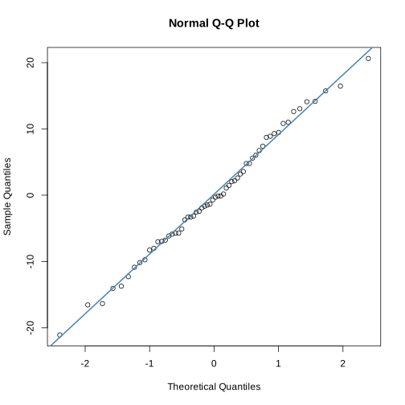

# One-Way ANOVA Analysis in R

This document outlines the steps taken to perform a one-way/two-way ANOVA analysis using R. The goal is to compare the effects of three different treatments on a continuous outcome variable.


## Perform One-Way ANOVA

- **Objective**: Determine if there are statistically significant differences among the means of three or more independent groups.

```R
anova_result <- aov(value ~ treatment, data = data_anova)
summary(anova_result)
```


```R
# Set seed for reproducibility
set.seed(123)

# Simulate data for a one-way ANOVA with three treatments
group_a <- rnorm(20, mean = 30, sd = 10) # Treatment A
group_b <- rnorm(20, mean = 75, sd = 10) # Treatment B
group_c <- rnorm(20, mean = 50, sd = 10) # Treatment C
# Combine the data into a data frame
data_anova <- data.frame(
  value = c(group_a, group_b, group_c),
  treatment = factor(rep(c("A", "B", "C"), each = 20))
)

```


```R
# Perform one-way ANOVA
anova_result <- aov(value ~ treatment, data = data_anova)
summary(anova_result)

```


                Df Sum Sq Mean Sq F value Pr(>F)    
    treatment    2  18599    9299   109.3 <2e-16 ***
    Residuals   57   4848      85                   
    ---
    Signif. codes:  0 ‘***’ 0.001 ‘**’ 0.01 ‘*’ 0.05 ‘.’ 0.1 ‘ ’ 1


```R
# QQ plot of residuals from one-way ANOVA
qqnorm(residuals(anova_result))
qqline(residuals(anova_result), col = "steelblue", lwd = 2)
```


    

    


* Objective: Assess the normality of the residuals, an assumption of ANOVA.


```R
# Residual plot from one-way ANOVA
plot(residuals(anova_result), main = "Residuals Plot", xlab = "Index", ylab = "Residuals")
abline(h = 0, col = "red", lwd = 2)

```


    

    


* Objective: Evaluate the homogeneity of variances and check for any patterns in the residuals.


```R
# Perform linear model
lm_result <- lm(value ~ treatment, data = data_anova)
summary(lm_result)
```


    
    Call:
    lm(formula = value ~ treatment, data = data_anova)
    
    Residuals:
         Min       1Q   Median       3Q      Max 
    -21.0824  -5.9407  -0.5103   6.2225  20.6247 
    
    Coefficients:
                Estimate Std. Error t value Pr(>|t|)    
    (Intercept)   31.416      2.062  15.235  < 2e-16 ***
    treatmentB    43.071      2.916  14.769  < 2e-16 ***
    treatmentC    19.649      2.916   6.738  8.7e-09 ***
    ---
    Signif. codes:  0 ‘***’ 0.001 ‘**’ 0.01 ‘*’ 0.05 ‘.’ 0.1 ‘ ’ 1
    
    Residual standard error: 9.222 on 57 degrees of freedom
    Multiple R-squared:  0.7932,	Adjusted R-squared:  0.786 
    F-statistic: 109.3 on 2 and 57 DF,  p-value: < 2.2e-16


* Objective: Provide an alternative method to analyze the data, offering detailed statistics and insights into the relationship between the treatment groups and the outcome variable.


```R
# Plotting using ggplot2
library(ggplot2)
ggplot(data_anova, aes(x = treatment, y = value, fill = treatment)) +
  geom_boxplot() +
  theme_minimal() +
  labs(title = "One-way ANOVA", y = "Value", x = "Treatment")

```


    

    


## Perform Two-Way ANOVA

- **Objective**: The objective of a two-way ANOVA is to evaluate the main effects of two independent variables on a dependent variable and to investigate if there's a significant interaction between them that affects the outcome.


```R
set.seed(123)

# Simulate data for a two-way ANOVA with three treatments and two blocks
group_a_day1 <- rnorm(10, mean = 30, sd = 10) # Treatment A, Day 1
group_b_day1 <- rnorm(10, mean = 75, sd = 10) # Treatment B, Day 1
group_c_day1 <- rnorm(10, mean = 50, sd = 10) # Treatment C, Day 1

group_a_day2 <- rnorm(10, mean = 30, sd = 10) # Treatment A, Day 2
group_b_day2 <- rnorm(10, mean = 75, sd = 10) # Treatment B, Day 2
group_c_day2 <- rnorm(10, mean = 50, sd = 10) # Treatment C, Day 2

# Combine the data into a data frame
data_anova_block <- data.frame(
  value = c(group_a_day1, group_b_day1, group_c_day1, group_a_day2, group_b_day2, group_c_day2),
  treatment = factor(rep(c("A", "B", "C", "A", "B", "C"), each = 10)),
  day = factor(rep(c("Day1", "Day1", "Day1", "Day2", "Day2", "Day2"), each = 10))
)
```


```R
# Perform two-way ANOVA with interaction between treatment and block
anova_block_result <- aov(value ~ treatment + day + treatment:day, data = data_anova_block)
summary(anova_block_result)
```


                  Df Sum Sq Mean Sq F value Pr(>F)    
    treatment      2  19708    9854 117.379 <2e-16 ***
    day            1     76      76   0.908  0.345    
    treatment:day  2    187      93   1.113  0.336    
    Residuals     54   4533      84                   
    ---
    Signif. codes:  0 ‘***’ 0.001 ‘**’ 0.01 ‘*’ 0.05 ‘.’ 0.1 ‘ ’ 1


```R
# QQ plot of residuals from two-way ANOVA
qqnorm(residuals(anova_block_result))
qqline(residuals(anova_block_result), col = "steelblue", lwd = 2)

```


    

    


```R
# Residual plot from two-way ANOVA
plot(residuals(anova_block_result), main = "Residuals Plot", xlab = "Index", ylab = "Residuals")
abline(h = 0, col = "red", lwd = 2)
```


    

    


```R
# Perform linear model with interaction
lm_block_result <- lm(value ~ treatment * day, data = data_anova_block)
summary(lm_block_result)

```


    
    Call:
    lm(formula = value ~ treatment * day, data = data_anova_block)
    
    Residuals:
         Min       1Q   Median       3Q      Max 
    -21.7524  -6.1984  -0.8624   4.9443  21.7767 
    
    Coefficients:
                       Estimate Std. Error t value Pr(>|t|)    
    (Intercept)          30.746      2.897  10.612 8.02e-15 ***
    treatmentB           46.340      4.098  11.309 7.35e-16 ***
    treatmentC           15.008      4.098   3.663 0.000569 ***
    dayDay2               2.474      4.098   0.604 0.548495    
    treatmentB:dayDay2   -4.648      5.795  -0.802 0.426061    
    treatmentC:dayDay2    3.988      5.795   0.688 0.494249    
    ---
    Signif. codes:  0 ‘***’ 0.001 ‘**’ 0.01 ‘*’ 0.05 ‘.’ 0.1 ‘ ’ 1
    
    Residual standard error: 9.163 on 54 degrees of freedom
    Multiple R-squared:  0.815,	Adjusted R-squared:  0.7979 
    F-statistic: 47.58 on 5 and 54 DF,  p-value: < 2.2e-16


```R
# Plotting using ggplot2, showing interaction
ggplot(data_anova_block, aes(x = treatment, y = value, fill = day)) +
  geom_boxplot() +
  theme_minimal() +
  labs(title = "Two-way ANOVA with Blocking", y = "Value", x = "Treatment")

```


    

    


```R
# Perform one-way ANOVA focusing only on treatment effects
anova_result <- aov(value ~ treatment, data = data_anova_block)
summary(anova_result)


ggplot(data_anova_block, aes(x = treatment, y = value, fill = treatment)) +
  geom_boxplot() +
  theme_minimal() +
  labs(title = "One-way ANOVA", y = "Value", x = "Treatment")

```


                Df Sum Sq Mean Sq F value Pr(>F)    
    treatment    2  19708    9854   117.1 <2e-16 ***
    Residuals   57   4796      84                   
    ---
    Signif. codes:  0 ‘***’ 0.001 ‘**’ 0.01 ‘*’ 0.05 ‘.’ 0.1 ‘ ’ 1


    

    


# Summary of One-Way vs. Two-Way ANOVA

## One-Way ANOVA

- **Focus**: Examines the effect of a single factor (treatment) on a dependent variable.
- **Objective**: Determine if there are significant differences between the means of three or more groups.
- **Usage**: Ideal when interested in the impact of one independent variable.

## Two-Way ANOVA

- **Focus**: Assesses the impact of two independent variables (treatments and blocks) on a dependent variable.
- **Objective**: Evaluate the main effects of each independent variable and their interaction effect on the dependent variable.
- **Usage**: Suitable for exploring the combined effect of two variables and their interaction.


**Note:** The slides used in this class can be found below.

<iframe src="https://docs.google.com/presentation/d/e/2PACX-1vRisZ7NR67jtM4x8qz3EsrNIe90jmG__eOyFL7ZgbhkNLly1d8hJqJq7_NLvrbsyw/embed?start=false&loop=false&delayms=3000" frameborder="0" width="640" height="389" allowfullscreen="true" mozallowfullscreen="true" webkitallowfullscreen="true"></iframe>


