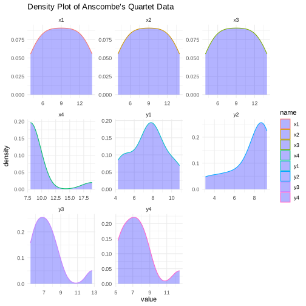
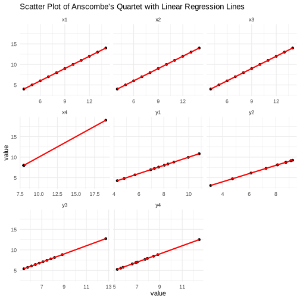

# Bar, Box, and Violin: Navigating Data Visualization for Insightful Analysis

Using Anscombe's quartet as our guide, we will explore how similar statistical properties can mask vastly different data characteristics. Our goal is to demonstrate the power of visualization in revealing the true nature of data, comparing the strengths and limitations of various plot types, including bar plots, box plots, and violin plots.

## 1. Introduction to Data Characteristics & Initial EDA

Exploratory Data Analysis (EDA) is a foundational step in data analysis, allowing us to understand the underlying patterns, spot anomalies, and formulate hypotheses about our data through visualization and statistical tools.

#### Key Concepts:

* Distribution: How values are spread or clustered across a range.

* Central Tendency: Where most values tend to fall (mean, median).

* Variability: The extent to which the data points differ from each other.


```R
data("anscombe")
```


```R
anscombe
```


<table class="dataframe">
<caption>A data.frame: 11 × 8</caption>
<thead>
	<tr><th scope=col>x1</th><th scope=col>x2</th><th scope=col>x3</th><th scope=col>x4</th><th scope=col>y1</th><th scope=col>y2</th><th scope=col>y3</th><th scope=col>y4</th></tr>
	<tr><th scope=col>&lt;dbl&gt;</th><th scope=col>&lt;dbl&gt;</th><th scope=col>&lt;dbl&gt;</th><th scope=col>&lt;dbl&gt;</th><th scope=col>&lt;dbl&gt;</th><th scope=col>&lt;dbl&gt;</th><th scope=col>&lt;dbl&gt;</th><th scope=col>&lt;dbl&gt;</th></tr>
</thead>
<tbody>
	<tr><td>10</td><td>10</td><td>10</td><td> 8</td><td> 8.04</td><td>9.14</td><td> 7.46</td><td> 6.58</td></tr>
	<tr><td> 8</td><td> 8</td><td> 8</td><td> 8</td><td> 6.95</td><td>8.14</td><td> 6.77</td><td> 5.76</td></tr>
	<tr><td>13</td><td>13</td><td>13</td><td> 8</td><td> 7.58</td><td>8.74</td><td>12.74</td><td> 7.71</td></tr>
	<tr><td> 9</td><td> 9</td><td> 9</td><td> 8</td><td> 8.81</td><td>8.77</td><td> 7.11</td><td> 8.84</td></tr>
	<tr><td>11</td><td>11</td><td>11</td><td> 8</td><td> 8.33</td><td>9.26</td><td> 7.81</td><td> 8.47</td></tr>
	<tr><td>14</td><td>14</td><td>14</td><td> 8</td><td> 9.96</td><td>8.10</td><td> 8.84</td><td> 7.04</td></tr>
	<tr><td> 6</td><td> 6</td><td> 6</td><td> 8</td><td> 7.24</td><td>6.13</td><td> 6.08</td><td> 5.25</td></tr>
	<tr><td> 4</td><td> 4</td><td> 4</td><td>19</td><td> 4.26</td><td>3.10</td><td> 5.39</td><td>12.50</td></tr>
	<tr><td>12</td><td>12</td><td>12</td><td> 8</td><td>10.84</td><td>9.13</td><td> 8.15</td><td> 5.56</td></tr>
	<tr><td> 7</td><td> 7</td><td> 7</td><td> 8</td><td> 4.82</td><td>7.26</td><td> 6.42</td><td> 7.91</td></tr>
	<tr><td> 5</td><td> 5</td><td> 5</td><td> 8</td><td> 5.68</td><td>4.74</td><td> 5.73</td><td> 6.89</td></tr>
</tbody>
</table>


```R
summary(anscombe)
```


           x1             x2             x3             x4           y1        
     Min.   : 4.0   Min.   : 4.0   Min.   : 4.0   Min.   : 8   Min.   : 4.260  
     1st Qu.: 6.5   1st Qu.: 6.5   1st Qu.: 6.5   1st Qu.: 8   1st Qu.: 6.315  
     Median : 9.0   Median : 9.0   Median : 9.0   Median : 8   Median : 7.580  
     Mean   : 9.0   Mean   : 9.0   Mean   : 9.0   Mean   : 9   Mean   : 7.501  
     3rd Qu.:11.5   3rd Qu.:11.5   3rd Qu.:11.5   3rd Qu.: 8   3rd Qu.: 8.570  
     Max.   :14.0   Max.   :14.0   Max.   :14.0   Max.   :19   Max.   :10.840  
           y2              y3              y4        
     Min.   :3.100   Min.   : 5.39   Min.   : 5.250  
     1st Qu.:6.695   1st Qu.: 6.25   1st Qu.: 6.170  
     Median :8.140   Median : 7.11   Median : 7.040  
     Mean   :7.501   Mean   : 7.50   Mean   : 7.501  
     3rd Qu.:8.950   3rd Qu.: 7.98   3rd Qu.: 8.190  
     Max.   :9.260   Max.   :12.74   Max.   :12.500  


```R
library(tidyr)
library(ggplot2)

anscombe_long <- pivot_longer(anscombe, cols = everything())

ggplot(anscombe_long, aes(x=value, color=name)) +
  geom_density(fill="blue", alpha=0.3) +
  facet_wrap(~name, scales="free") +
  theme_minimal() +
  labs(title="Density Plot of Anscombe's Quartet Data")

```





## 2.Scatter plots and linear regression lines.
Anscombe's quartet comprises four datasets with identical statistical properties but drastically different distributions and relationships. It serves as a perfect illustration of why visual analysis is indispensable.

### Visualization:
We plot each dataset of the quartet to reveal its unique characteristics, using scatter plots and linear regression lines.


```R
ggplot(anscombe_long, aes(x=value, y=value, group=name)) +
  geom_point() +
  geom_smooth(method="lm", se=FALSE, color="red") +
  facet_wrap(~name, scales = "free_x") +
  theme_minimal() +
  labs(title="Scatter Plot of Anscombe's Quartet with Linear Regression Lines")

```

    `geom_smooth()` using formula = 'y ~ x'





## 3. The Deception of Bar Plots

Bar plots are widely used for comparing quantities. They summarize data into single metrics like mean or median, potentially oversimplifying the data's story.

Limitations:
* Oversimplification: Fails to show the distribution or variability.
* Misleading Interpretation: Can imply nonexistent uniformity across data.

We attempt to represent Anscombe's quartet using bar plots, highlighting their inadequacy in capturing the datasets' nuances.


```R
library(dplyr)

anscombe_means <- anscombe_long %>%
  group_by(name) %>%
  summarise(mean=mean(value), se=sd(value)/sqrt(n()))

ggplot(anscombe_means, aes(x=name, y=mean, fill=name)) +
  geom_bar(stat="identity", position=position_dodge()) +
  geom_errorbar(aes(ymin=mean-se, ymax=mean+se), width=0.2) +
  theme_minimal() +
  labs(title="Bar Plot with Mean and SE for Anscombe's Quartet")

```


    Attaching package: ‘dplyr’


    The following objects are masked from ‘package:stats’:

        filter, lag


    The following objects are masked from ‘package:base’:

        intersect, setdiff, setequal, union


## 4. The Revelatory Power of Box Plots

Box plots, or box-and-whisker plots, offer a more detailed view of the data's distribution, including median, quartiles, and outliers, providing a clearer picture of variability and central tendency.

#### Strengths:
* Detailed Summary: Shows the spread and centers of the data.
* Outlier Detection: Easily identifies outliers.

We visualize Anscombe's quartet with box plots, appreciating their ability to reveal more about the data's distribution than bar plots.


```R
ggplot(anscombe_long, aes(x=name, y=value, fill=name)) +
  geom_boxplot() +
  theme_minimal() +
  labs(title="Box Plot of Anscombe's Quartet")

```


## 5. Beyond Box Plots: Embracing Violin Plots

While box plots are informative, violin plots take visualization a step further by combining the box plot's summary statistics with a density plot's shape information.

Advantages:
* Richer Data Representation: Shows the distribution's shape, thickness indicating the density.
* Combines Best of Both Worlds: Includes median and IQR of box plots with the added context of data distribution.

We visualize the data with violin plots of the quartet, showcasing how they offer a comprehensive view of our data's behavior.


```R
ggplot(anscombe_long, aes(x=name, y=value, fill=name)) +
  geom_violin(trim=FALSE) +
  geom_jitter(width=0.1, alpha=0.5) +
  theme_minimal() +
  labs(title="Violin Plot of Anscombe's Quartet")

```


```R
install.packages('gridExtra')
library(grid)
library(gridExtra)

p1 <- ggplot(anscombe) +
  geom_point(aes(x1, y1), color = "darkorange", size = 1.5) +
  scale_x_continuous(breaks = seq(0,20,2)) +
  scale_y_continuous(breaks = seq(0,12,2)) +
  expand_limits(x = 0, y = 0) +
  labs(x = "x1", y = "y1",
       title = "Dataset 1" ) +
  theme_bw()

p2 <- ggplot(anscombe) +
  geom_point(aes(x2, y2), color = "darkorange", size = 1.5) +
  scale_x_continuous(breaks = seq(0,20,2)) +
  scale_y_continuous(breaks = seq(0,12,2)) +
  expand_limits(x = 0, y = 0) +
  labs(x = "x2", y = "y2",
       title = "Dataset 2" ) +
  theme_bw()

p3 <- ggplot(anscombe) +
  geom_point(aes(x3, y3), color = "darkorange", size = 1.5) +
  scale_x_continuous(breaks = seq(0,20,2)) +
  scale_y_continuous(breaks = seq(0,12,2)) +
  expand_limits(x = 0, y = 0) +
  labs(x = "x3", y = "y3",
       title = "Dataset 3" ) +
  theme_bw()

p4 <- ggplot(anscombe) +
  geom_point(aes(x4, y4), color = "darkorange", size = 1.5) +
  scale_x_continuous(breaks = seq(0,20,2)) +
  scale_y_continuous(breaks = seq(0,12,2)) +
  expand_limits(x = 0, y = 0) +
  labs(x = "x4", y = "y4",
       title = "Dataset 4" ) +
  theme_bw()

grid.arrange(grobs = list(p1, p2, p3, p4),
             ncol = 2,
             top = "Anscombe's Quartet")

```

    Updating HTML index of packages in '.Library'

    Making 'packages.html' ...
     done


    Attaching package: ‘gridExtra’


    The following object is masked from ‘package:dplyr’:

        combine


```R
lm1 <- lm(y1 ~ x1, data = anscombe)
lm2 <- lm(y2 ~ x2, data = anscombe)
lm3 <- lm(y3 ~ x3, data = anscombe)
lm4 <- lm(y4 ~ x4, data = anscombe)

p1_fitted <- p1 + geom_abline(intercept = 3.0001, slope = 0.5001, color = "blue")
p2_fitted <- p2 + geom_abline(intercept = 3.001, slope = 0.500, color = "blue")
p3_fitted <- p3 + geom_abline(intercept = 3.0025, slope = 0.4997, color = "blue")
p4_fitted <- p4 + geom_abline(intercept = 3.0017, slope = 0.499, color = "blue")

grid.arrange(grobs = list(p1_fitted, p2_fitted,
                          p3_fitted, p4_fitted),
             ncol = 2,
             top = "Anscombe's Quartet")

```


## Conclusion & Q&A

Through this workshop, we've seen how critical visualizations are in data analysis, moving from the deceptive simplicity of bar plots to the detailed insights offered by box and violin plots. Each type of visualization serves its purpose, but understanding their strengths and limitations is key to uncovering the true story behind our data.


```R

```
