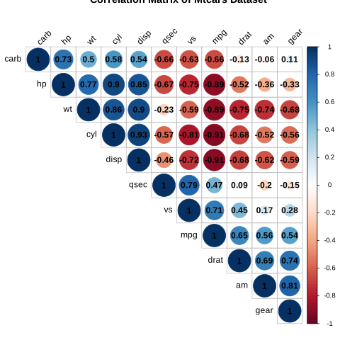
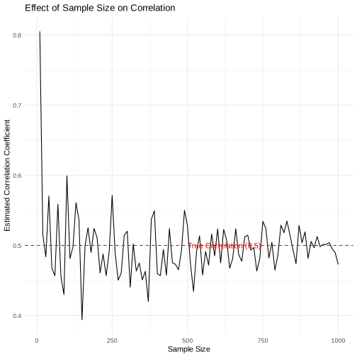

# Correlation and Causation

- **Correlation**:
  - A statistical measure indicating the extent to which two or more variables fluctuate together.
  - Values range from -1 (perfect negative correlation) to +1 (perfect positive correlation), with 0 indicating no correlation.

- **Causation**:
  - Implies that a change in one variable is responsible for a change in another.
  - This relationship establishes a cause and effect between variables.

- **Differentiation**:
  - Correlation does not imply causation; two variables can be correlated without one causing the other to change.
  - Causation explicitly requires a cause-and-effect relationship, often established through controlled experiments.

- **Importance of Visualizations**:
  - Visual tools like scatter plots and correlation matrices help in identifying patterns and relationships between variables.
  - Effective visualization aids in distinguishing between mere correlations and potential causative relationships, guiding further statistical analysis or experimental design.


```R
if (!requireNamespace("ggplot2", quietly = TRUE)) install.packages("ggplot2")
if (!requireNamespace("corrplot", quietly = TRUE)) install.packages("corrplot")

# Load packages
library(ggplot2)
library(corrplot)
```

    corrplot 0.92 loaded


### Visualize Correlation with Synthetic Data


```R
# Generate data with correlation
set.seed(123)
n <- 100
x <- rnorm(n)
y <- x + rnorm(n)

correlation_coeff <- cor(x, y)

# ggplot
library(ggplot2)
df <- data.frame(x = x, y = y)
ggplot(df, aes(x, y)) +
  geom_point() +
  geom_smooth(method = "lm", se = FALSE, color = "red") +
  labs(title = "Scatterplot showing correlation", x = "X", y = "Y") +
  annotate("text", x = 1, y = 4, label = paste("Correlation coefficient:", round(correlation_coeff, 2)))

```

    `geom_smooth()` using formula = 'y ~ x'


### Visualize Correlations in MTCARS data


```R
data("mtcars")
head(mtcars)
```


<table class="dataframe">
<caption>A data.frame: 6 × 11</caption>
<thead>
	<tr><th></th><th scope=col>mpg</th><th scope=col>cyl</th><th scope=col>disp</th><th scope=col>hp</th><th scope=col>drat</th><th scope=col>wt</th><th scope=col>qsec</th><th scope=col>vs</th><th scope=col>am</th><th scope=col>gear</th><th scope=col>carb</th></tr>
	<tr><th></th><th scope=col>&lt;dbl&gt;</th><th scope=col>&lt;dbl&gt;</th><th scope=col>&lt;dbl&gt;</th><th scope=col>&lt;dbl&gt;</th><th scope=col>&lt;dbl&gt;</th><th scope=col>&lt;dbl&gt;</th><th scope=col>&lt;dbl&gt;</th><th scope=col>&lt;dbl&gt;</th><th scope=col>&lt;dbl&gt;</th><th scope=col>&lt;dbl&gt;</th><th scope=col>&lt;dbl&gt;</th></tr>
</thead>
<tbody>
	<tr><th scope=row>Mazda RX4</th><td>21.0</td><td>6</td><td>160</td><td>110</td><td>3.90</td><td>2.620</td><td>16.46</td><td>0</td><td>1</td><td>4</td><td>4</td></tr>
	<tr><th scope=row>Mazda RX4 Wag</th><td>21.0</td><td>6</td><td>160</td><td>110</td><td>3.90</td><td>2.875</td><td>17.02</td><td>0</td><td>1</td><td>4</td><td>4</td></tr>
	<tr><th scope=row>Datsun 710</th><td>22.8</td><td>4</td><td>108</td><td> 93</td><td>3.85</td><td>2.320</td><td>18.61</td><td>1</td><td>1</td><td>4</td><td>1</td></tr>
	<tr><th scope=row>Hornet 4 Drive</th><td>21.4</td><td>6</td><td>258</td><td>110</td><td>3.08</td><td>3.215</td><td>19.44</td><td>1</td><td>0</td><td>3</td><td>1</td></tr>
	<tr><th scope=row>Hornet Sportabout</th><td>18.7</td><td>8</td><td>360</td><td>175</td><td>3.15</td><td>3.440</td><td>17.02</td><td>0</td><td>0</td><td>3</td><td>2</td></tr>
	<tr><th scope=row>Valiant</th><td>18.1</td><td>6</td><td>225</td><td>105</td><td>2.76</td><td>3.460</td><td>20.22</td><td>1</td><td>0</td><td>3</td><td>1</td></tr>
</tbody>
</table>


```R
cor_matrix <- cor(mtcars)
corrplot(cor_matrix, method = "circle")

```


```R
cor_matrix <- cor(mtcars)

corrplot(cor_matrix, method = "circle", type = "upper", order = "hclust",
         addCoef.col = "black", # Color of the correlation coefficients
         tl.col = "black", tl.srt = 45, # Color and rotation of the labels
         title = "Correlation Matrix of Mtcars Dataset")

```


```R
cor_matrix <- cor(mtcars, method="spearman")
corrplot(cor_matrix, method = "circle", type = "upper", order = "hclust",
         addCoef.col = "black",
         tl.col = "black", tl.srt = 45,
         title = "Correlation Matrix of Mtcars Dataset")
```





### Choosing Between Spearman's and Pearson's Correlation

### Pearson's Correlation Coefficient
- **Appropriate for Continuous Data**: Best suited for data measured on an interval or ratio scale.
- **Assumes Normal Distribution**: The data should be approximately normally distributed.
- **Linear Relationships**: Used to assess the strength and direction of a linear relationship between two variables.
- **Sensitivity to Outliers**: Can be significantly affected by outliers.
- **Homoscedasticity Required**: Assumes that the variance of one variable is constant at all levels of the other variable.

#### Spearman's Rank Correlation Coefficient
- **Non-Parametric**: Does not assume a specific distribution for the data.
- **Ordinal Data**: Suitable for ordinal data or when ranking variables.
- **Monotonic Relationships**: Effective for detecting both increasing and decreasing relationships, not limited to linear.
- **Robust to Outliers**: Less sensitive to outliers than Pearson's correlation because it uses rank orders.
- **Nonlinear Relationships**: Can handle nonlinear relationships well, provided they are monotonic.

#### Summary
- **Use Pearson's** when dealing with continuous data that are normally distributed and you're interested in linear relationships, but be wary of outliers.
- **Use Spearman's** for ordinal data, non-normal distributions, or nonlinear relationships, and when dealing with outliers or non-homoscedastic data.


```R
# Scatter plot of mpg vs. wt
ggplot(mtcars, aes(x = wt, y = mpg)) +
  geom_point() +
  geom_smooth(method = "lm", color = "blue") +
  ggtitle("MPG vs. Weight") +
  theme_minimal()

```

    `geom_smooth()` using formula = 'y ~ x'


### How Does Sample Size Effect Correlation


```R
# Simulate data and calculate correlation
simulate_correlation <- function(n, rho = 0.5) {
  x <- rnorm(n)
  y <- rho * x + sqrt(1 - rho^2) * rnorm(n)
  cor(x, y)
}

# Different sample sizes
sample_sizes <- seq(10, 1000, by = 10)

# Calculate correlation for each sample size
set.seed(123)
correlations <- sapply(sample_sizes, simulate_correlation)

# Create a dataframe
data_for_plot <- data.frame(sample_size = sample_sizes, correlation = correlations)

# Plotting
ggplot(data_for_plot, aes(x = sample_size, y = correlation)) +
  geom_line() +
  geom_hline(yintercept = 0.5, linetype = "dashed", color = "red") +
  labs(title = "Effect of Sample Size on Correlation",
       x = "Sample Size",
       y = "Estimated Correlation Coefficient") +
  theme_minimal() +
  annotate("text", x = 500, y = 0.5, label = "True Correlation (0.5)", hjust = 0, color = "red")

```





### Causation Analysis Guide

- **Identify Variables**:
  - Determine the independent (predictor) and dependent (outcome) variables for your analysis.

- **Collect Data**:
  - Gather data that is relevant to your hypothesis. Preferably use data from randomized controlled trials (RCTs) to minimize bias.

- **Statistical Models**:
  - Employ statistical models such as regression analysis to estimate the relationship between variables. Include potential confounders.

- **Control for Confounders**:
  - Identify and adjust for confounding variables that might influence both the independent and dependent variables.

- **Use Appropriate Tests**:
  - Apply statistical tests (e.g., t-tests, ANOVA) to determine the significance of the observed relationships.

- **Consider Experimental Design**:
  - If possible, design experiments to randomly assign subjects to treatment and control groups to establish causality.

- **Check Assumptions**:
  - Ensure your data and model comply with the assumptions required for your statistical tests and models.

- **Interpret Results Carefully**:
  - Analyze the output of your statistical tests, considering the size and significance of effects. Be cautious about drawing causal conclusions.

- **Validate Findings**:
  - Use external data, replication studies, or different statistical methods to validate your findings.

- **Report with Transparency**:
  - Clearly document your methodology, analysis, and limitations. Acknowledge any uncertainties in establishing causation.


```R
library(tidyverse)
```

    ── Attaching packages ─────────────────────────────────────── tidyverse 1.3.2 ──
    ✔ tibble  3.2.1     ✔ dplyr   1.1.1
    ✔ tidyr   1.3.0     ✔ stringr 1.5.0
    ✔ readr   2.1.3     ✔ forcats 0.5.2
    ✔ purrr   1.0.1     
    ── Conflicts ────────────────────────────────────────── tidyverse_conflicts() ──
    ✖ dplyr::filter() masks stats::filter()
    ✖ dplyr::lag()    masks stats::lag()


### Hypothetical Scenario:

Imagine we have a dataset from examining the effect of a new educational program on student performance, where:

* treatment is a binary variable indicating participation in the program (1 for participants, 0 for control group).
* pre_test is a score on a standardized test before the program starts.
* post_test is a score on a standardized test after the program ends.
* The dataset is called edu_data.


```R
set.seed(123)
n <- 100
edu_data <- data.frame(
  treatment = sample(c(0, 1), size = n, replace = TRUE, prob = c(0.5, 0.5)),
  pre_test = rnorm(n, mean = 75, sd = 10),
  post_test = NA
)

# Assuming the treatment has a positive effect
edu_data$post_test[edu_data$treatment == 1] <- edu_data$pre_test[edu_data$treatment == 1] + rnorm(sum(edu_data$treatment == 1), mean = 5, sd = 5)
edu_data$post_test[edu_data$treatment == 0] <- edu_data$pre_test[edu_data$treatment == 0] + rnorm(sum(edu_data$treatment == 0), mean = 0, sd = 5)

head(edu_data)

```


<table class="dataframe">
<caption>A data.frame: 6 × 3</caption>
<thead>
	<tr><th></th><th scope=col>treatment</th><th scope=col>pre_test</th><th scope=col>post_test</th></tr>
	<tr><th></th><th scope=col>&lt;dbl&gt;</th><th scope=col>&lt;dbl&gt;</th><th scope=col>&lt;dbl&gt;</th></tr>
</thead>
<tbody>
	<tr><th scope=row>1</th><td>1</td><td>77.53319</td><td>86.47188</td></tr>
	<tr><th scope=row>2</th><td>0</td><td>74.71453</td><td>77.43050</td></tr>
	<tr><th scope=row>3</th><td>1</td><td>74.57130</td><td>83.41651</td></tr>
	<tr><th scope=row>4</th><td>0</td><td>88.68602</td><td>86.61432</td></tr>
	<tr><th scope=row>5</th><td>0</td><td>72.74229</td><td>70.36106</td></tr>
	<tr><th scope=row>6</th><td>1</td><td>90.16471</td><td>96.82572</td></tr>
</tbody>
</table>


```R
# Calculate average improvement by group
avg_improvement <- edu_data %>%
  mutate(improvement = post_test - pre_test) %>%
  group_by(treatment) %>%
  summarize(mean_improvement = mean(improvement))

print(avg_improvement)

```

    # A tibble: 2 × 2
      treatment mean_improvement
          <dbl>            <dbl>
    1         0           -0.391
    2         1            5.49


```R
ggplot(edu_data, aes(x = factor(treatment), y = post_test - pre_test, fill = factor(treatment))) +
  geom_boxplot() +
  labs(x = "Treatment Group", y = "Improvement in Test Scores", fill = "Group") +
  theme_minimal() +
  ggtitle("Effect of Educational Program on Test Score Improvement")

```


```R
t.test(post_test ~ treatment, data = edu_data)

```


    	Welch Two Sample t-test

    data:  post_test by treatment
    t = -4.0852, df = 97.985, p-value = 9.011e-05
    alternative hypothesis: true difference in means between group 0 and group 1 is not equal to 0
    95 percent confidence interval:
     -13.50354  -4.67358
    sample estimates:
    mean in group 0 mean in group 1
           72.37132        81.45988


```R

```
