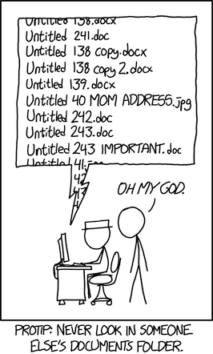
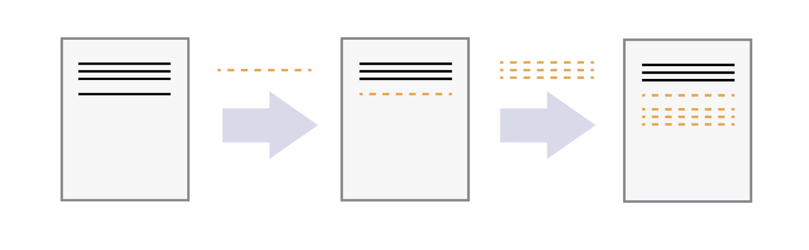
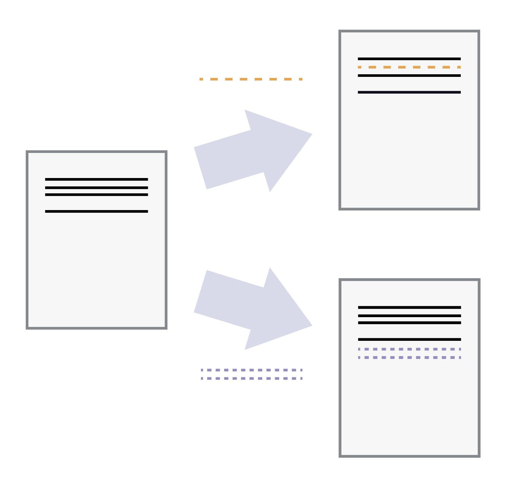
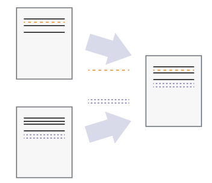
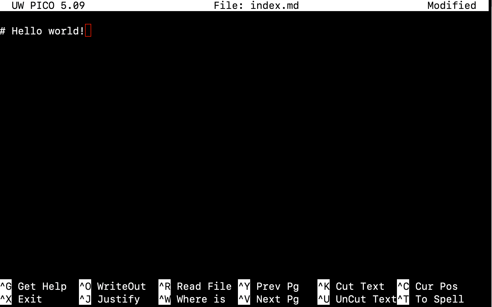
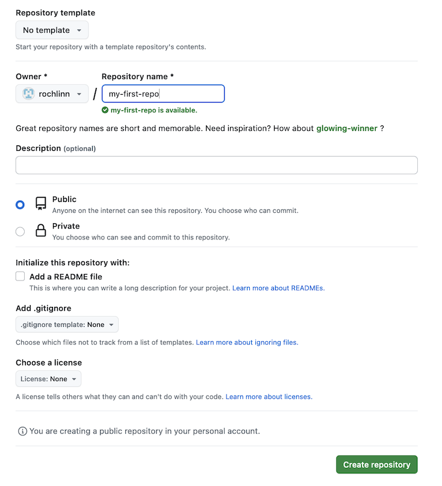
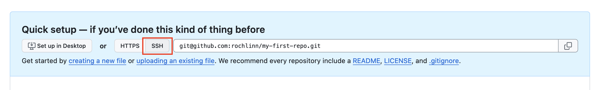
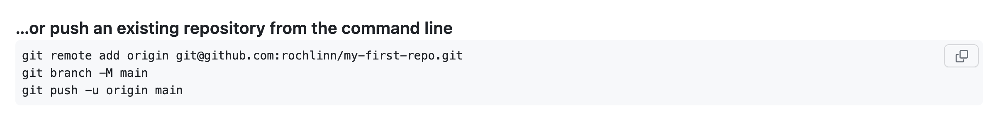
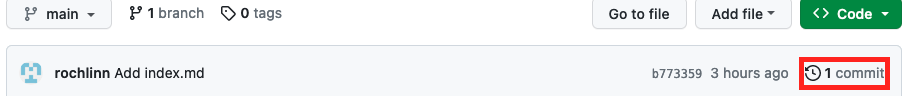

# Introduction to GitHub

Last Updated: 2023-10-27

## Setup

In order to proceed with this lesson there are a couple things you'll need to setup:

* Setup a GitHub account
  * Go to [https://github.com/](https://github.com/) and follow the "Sign up" link at the top-right of the window.
  * Follow the instructions to create an account.
  * Verify your email address with GitHub.
* If you have not already done so, you will need to [install git on your computer](https://docs.github.com/en/get-started/quickstart/set-up-git).

--- 

## What is Version Control?

Before we jump into GitHub, it's worth first to have a bit of a discussion about version control. I'm sure all of us are familiar with a situation where a file's versioning can grow out of control:

Version control software and tools are a valuable way to record changes you make to a file to help avoid falling into the pits of having numerous nearly identical files. Things like Microsoft Word's 'Track Changes', or Google Doc's 'Version History' are examples of automated version control systems. Version control systems begin with a base version of a document, and then record changes you make each step of the way.  You can start making additions to the document, and then can rewind to the base of the document to review each change you made, eventually arriving at your most recent version.

Once you think of changes as separate from the document itself, you can then think about “playing back” different sets of changes on the base document, ultimately resulting in different versions of that document. For example, two users can make independent sets of changes on the same document.

Unless multiple users make changes to the same section of the document - a conflict - you can incorporate two sets of changes into the same base document.

### Benefits of Using Version Control

* **Collaboration**: Version control allows us to define formalized ways we can work together and share writing and code. For example merging together sets of changes from different parties enables co-creation of documents and software across distributed teams.
* **Versioning**: Having a robust and rigorous log of changes to a file, without renaming files (v1, v2, final_copy)
* **Rolling Back**: Version control allows us to quickly undo a set of changes. This can be useful when new writing or new additions to code introduce problems.
* **Understanding**: Version control can help you understand how the code or writing came to be, who wrote or contributed particular parts, and who you might ask to help understand it better.
* **Backup**: While not meant to be a backup solution, using version control systems mean that your code and writing can be stored on multiple other computers.

---

## Git and GitHub

We often hear the terms ***Git*** and ***GitHub*** used interchangeably, but there are slightly different things.

***Git*** is one of the most widely used version control systems in the world. It is a free, open source tool that can be downloaded to your local machine and used for logging all changes made to a group of designated computer files (referred to as a “git repository” or “repo” for short) over time. It can be used to control file versions locally by you alone on your computer, but is perhaps most powerful when employed to coordinate simultaneous work on a group of files shared among distributed groups of people.

Git was originally developed to help software developers work collaboratively on software projects, but it can be and is used for managing revisions to any file type on a computer system, including text documents and spreadsheets. Once installed, interaction with Git is done through the Command Prompt in Windows, or the Terminal on Mac/Linux. Since Word documents contain special formatting, Git unfortunately cannot version control those, nor can it version control PDFs, though both file types can be stored in Git repositories.

***GitHub*** on the other hand is a popular website for hosting and sharing Git repositories remotely. It offers a web interface and provides functionality and a mixture of both free and paid services for working with such repositories. The majority of the content that GitHub hosts is open source software, though increasingly it is being used for other projects such as open access journals (e.g. [Journal of Open Source Software](https://joss.theoj.org/)), blogs, and regularly updated text books

---

## Getting Started with Git

### Setting up Git

When we use Git on a new computer for the first time, we need to configure a few things. The basic elements of a configuration for Git are:

* Your name and email address,
* What your preferred text editor is,
* The name of your default branch (branches are an important component of Git that we will cover later).

To get this started, open your shell terminal window, and enter the following commands:

> $ git config --global user.name "Your Name"
> $ git config --global user.email "yourname@domain.name"

If you enter the commands correctly, the shell will merely return a command prompt and no messages. To check your work, ask Git what your configuration is using the same command as above:

> $ git config --list

And the output will be:

>user.name=Your Name
>user.email=yourname@domain.name

**Text Editors**

As mentioned in the [Introduction to the Unix Shell Part 2](https://csc-ubc-okanagan.github.io/workshops/UNIX_pt2.html) session, There are many different text editors to choose from. Nano is a text editor that can be used to create and edit plain text files via the command line. When we say ‘plain text’, it can only work with plain character data, and doesn’t work with tables, images, or any other media. For the purpose of this lesson, we are going to use Nano because it’s one of the least complex. As you move forward in your Unix journey, feel free to explore and play with different brands of text editors. For the purpose of this lesson, we will be working on .txt files, but there are other plain-text file types that you are also free to explore.

Any text editor can be set up as the default editor for Git. To set Nano as the default editor, enter the following command:

> $ git config --global core.editor "nano -w"

The final thing we need to do is set the name of our default branch to *main*:

> $ git config --global init.defaultBranch main

The `init.defaultBranch` value configures git to set the default branch to `main` instead of `master`.

## Creating a Repository

A Git **repository** is a data structure used to track changes to a set of project files over time. Repositories are stored within the same directory as these project files, in a hidden directory called `.git`. We can create a new git repository either by using [GitHub’s web interface](https://github.com/new), or via the command line. Let’s use the command line to create a git repository for the experiments that we’re going to do today.

First, move to the `Desktop` directory on your machine.

Next, we're going to create a new directory for our project and enter that directory. To do so, enter the following commands. Feel free to name your directory whatever you'd like, noting appropriate naming conventions!

> $ mkdir my-first-repo
> $ cd my-first-repo

### Using Git

On a command line interface, Git commands are written as `git + verb + options`, where `verb` is what we actually want to do and `options` is additional optional information which may be needed for the `verb`. So let’s get started with our setup.

We will now create an empty git repository to track changes to our project. To do this we will use the `git init` command, which is simply short for initialize.

> $ git init

The output from this command should be:

>Initialized empty Git repository in <you-file-path/repository-name/.git/

The `my-first-repo` (or whatever you named your directory) is now a git repository.

If we run the `ls` command now (`ls` lists the content of the directory), the repository might seem empty; however, adding the `-a` flag for all files via `ls -a` will show all hidden files, which in this case includes the new hidden directory `.git`. 

Note that whenever we use git via the command line, we need to preface each command (or verb) with `git`, so that the computer knows we are trying to get git to do something, rather than some other program.

### Displaying the Current Project's Status

You can run the `git status` command to display the current state of a project:

> $ git status

At this point, the output of this command should be:

> On branch main
> No commits yet
> nothing to commit (create/copy files and use "git add" to track)

The output tells us that we are on the main branch (more on this later) and that we have nothing to commit (no unsaved changes).

### Two Steps: Adding and Committing

We will now create and save our first project file. This is a two-step process. First, we **add** any files for which we want to save the changes to a staging area, then we **commit** those changes to the repository. This two-stage process gives us fine-grained control over what should and should not be included in a particular commit.

Let's create a new file using the `touch` command, which is a quick way to create an empty file.

> $ touch index.md

The `.md` extension above signifies that we have chosen to use the Markdown format, a lightweight markup language with plain text formatting syntax. We will explore Markdown a bit later.

Let's check the status of our project again.

> $ git status

Output:

> On branch main
> No commits yet
> Untracked files:
>  (use "git add <file>..." to include in what will be committed)
>
>    index.md

This status is telling us that git has noticed a new file in our directory that we are not yet tracking. With colourised output, the filename will appear in red. To change this, and to tell Git we want to track any changes we make to index.md, we use `git add`.

> $ git add index.md

This adds our Markdown file to the **staging area** (the area where git checks for file changes). To confirm this we want to use `git status` again.

> $ git status

Output:

> On branch main
> No commits yet
>
> Changes to be committed:
>   (use "git rm --cached <file>..." to unstage)
>
>   new file:   index.md

If we are using colourised output, we will see that the filename has changed colour (from red to green). Git also tells us that there is a new file to be committed but, before we do that, let’s add some text to the file.

We will open the file `index.md` using any text editor (for this lesson we are using `nano`), and enter `# Hello, world!`. The has character is one way of writing a header with Markdown. Now, let's save the file within the text editor and check if Git has spotted the changes.

> nano index.md

This will open a window that looks like this:

Once you have typed `# Hello world!`, click `ctrl + x`, press `Y` to confirm saving the work, and then `enter` to confirm the file name that you are saving to.

Now let's check the status again:

> $ git status

Output:

> On branch main
>
> No commits yet
>
> Changes to be committed:
>  (use "git rm --cached <file>..." to unstage)
>
>	new file:   index.md
>
> Changes not staged for commit:
>  (use "git add <file>..." to update what will be committed)
>  (use "git checkout -- <file>..." to discard changes in working directory)
>
>	modified:   index.md

This lets us know that git has indeed spotted the changes to our file, but that it hasn’t yet staged them, so let’s add the new version of the file to the staging area.

> $ git add index.md

Now we are ready to **commit** our first changes. Commit is similar to ‘saving’ a file to Git. However, compared to saving, a commit provides a lot more information about the changes we have made, and this information will remain visible to us later.

> $ git commit -m 'Add index.md'

Output:

>[main (root-commit) e9e8fd3] Add index.md
> 1 file changed, 1 insertion(+)
> create mode 100644 index.md

We can see that one file has changed and that we made one insertion, which was a line with the text `#Hello, world!`. We can also see the commit message `Add index.md`, which we added by using the `-m`` flag after `git commit`. The commit message is used to record a short, descriptive, and specific summary of what we did to help us remember later on without having to look at the actual changes. If we just run `git commit` without the `-m` option, Git will launch nano (or whatever other editor we configured as `core.editor`) so that we can write a longer message.

Having made a commit, we now have a permanent record of what was changed, and git has also recorded some additional metadata: who made the commit (you!) and when the commit was made (timestamp). You are building a mini-history of your process of working with the files in this directory.

## Sharing Your Work

At the moment, our changes are only recorded locally, on our computer. If we wanted to work collaboratively with someone else they would have no way of seeing what we’ve done. We will fix that by using GitHub to share our work.

### Create a Repository on GitHub

Go to the [GitHub website](https://github.com/) and log in. To create a new repository, select the `+` icon in the upper-right corner of the page, and select **New Repository**.

---

Clicking `New Repository` will take you to a page with a lot of options to create a repository. For this workshop, we won't be using any of these options, but they are definitely worth exploring!

Name your new repository `my-first-repo`, to match the repository you created on your Desktop.

GitHub will ask if you want to add a README.me file, a `.gitignore` file, or a license. Do not do any of that for now, as we'll be starting with a completely empty repository.

After naming the repository, click the `Create Repository` button.

## Connecting Your Local Repository to the GitHub Repository

The next page that GitHub displays contains some information to help you connect your repository on GitHub with your local repository (on your own computer). To make this connection, we want to tell our local repository that GitHub is the `remote` repository. In order to do that we need the information that GitHub displays in the “Quick setup” box on this page.

We will use the Secure Shell (SSH) protocol for this lesson, so please make sure that button shows that it is selected (gray highlight) and that the address in the text box starts with `git@github. It will look something like this:

Although SSH requires some additional configuration, it is a security protocol used in many applications. The steps below describe SSH at a minimum level for GitHub.

Right now, we have a local repository on our own computer, but ewe also have a newly crealy remote repository on GitHub.  At this point, the two are completely separate from each other, but we want to link them together to synchronize them and share our project.

To do this, we will use the commands provided by GitHub with the heading **"..or push to an existing repository from the command line."**

Let's move back to the shell, and enter the first command:

> $ git remote add origin git@github.com:yourname/hello-world.git

Make sure to use the URL for your actual repository user name rather than `yourname`: the only difference should be your username instead of `yourname`.

Let’s breakdown the elements of the command. All commands related to Git in the shell start by invoking the Git language by typing `git` at the start. `remote add` is the command in the Git language we use to configure a remote repository, e.g., another Git repository that contains the same content as our local repository, but that is not on our computer. `origin` is the nickname we’re telling our local machine to use to for the following long web address. After we enter this command, we can use `origin` to refer to this specific repository in GitHub instead of the URL.

We can check that it is setup correctly with the command:

> $ git remote -v

This should result in the following output:

> origin  git@github.com:<your_github_username>/hello-world.git (fetch)
> origin  git@github.com:<your_github_username>/hello-world.git (push)

### SSH Background and Setup

We still need to do a little more setup before we can actually connect to this remote repository. We need to set up a way for our local computer to authenticate with GitHub so that GitHub recognizes our computer as belonging to the same person who owns the GitHub repository.

We will use SSH as our authentication method. SSH stands for Secure SHell protocol. SSH is a cryptographic network protocol that allows secure communication between computers using an otherwise insecure network.

SSH uses what is called a key pair – two keys that work together to validate access. One key is used publicly (the public key) and the other key is kept private (the private key).

You can think of the public key as a padlock, and only you have the key (the private key) to open it. You use the public key where you want a secure method of communication, such as your GitHub account. You give this padlock, or public key, to GitHub and say “lock the communications to my account with this so that only computers that have my private key can unlock communications and send Git commands as my GitHub account.”

What we will do now is the minimum required to set up the SSH keys and add the public key to a GitHub account. I’m not going to lie, this is a bit tedious and confusing. But you have to do it to get to the fun part, so hang in there.

The first thing we are going to do is check if this has already been done on the computer you’re on.

To do this, we will run the `ls` command to check what key pairs already exist on your computer.  In our command we use the `~` as the shorthand for "my home directory."

> $ ls -al ~/.ssh

Your output is going to look a little different depending on whether or not SSH has ever been set up on the computer you are using.

If you have not set up SSH, your output might look like this:

> ls: cannot access '/c/Users/YourName/.ssh': No such file or directory

If SSH has been set up on the computer you’re using, the public and private key pairs will be listed. The file names are either `id_ed25519`/`id_ed25519.pub` or `id_rsa`/`id_rsa.pub` depending on how the key pairs were set up.

If you do not have SSH set up, let’s set it up now. Use this command to create key pairs:

> $ ssh-keygen -t ed25519 -C "yourname@domain.name"

Output:

> Generating public/private ed25519 key pair.
> Enter file in which to save the key (/c/Users/YourName/.ssh/id_ed25519):

Because we want to use the default file, you can just press `enter`

Output:

> Created directory '/c/Users/YourName/.ssh'.
> Enter passphrase (empty for no passphrase):

Your computer is now asking you for a passphrase to protect this SSH key pair. We recommend that you use a passphrase and that you make a note of it. There is no “reset my password” option for this setup. If you forget your passphrase, you have to delete your existing key pair and do this setup again. It’s not a big deal, but easier if you don’t have to repeat it.

Output:

> Enter same passphrase again

After entering the passphrase a second time, you should receive this confirmation:

> Your identification has been saved in /c/Users/YourName/.ssh/id_ed25519
> Your public key has been saved in /c/Users/YourName/.ssh/id_ed25519.pub
> The key fingerprint is:
> SHA256:SMSPIStNyA00KPxuYu94KpZgRAYjgt9g4BA4kFy3g1o yourname@domain.name
> The key's randomart image is:
> +--[ED25519 256]--+
> |^B== o.          |
> |%*=.*.+          |
> |+=.E =.+         |
> | .=.+.o..        |
> |....  . S        |
> |.+ o             |
> |+ =              |
> |.o.o             |
> |oo+.             |
> +----[SHA256]-----+

The “identification” is actually the private key. You should never share it. The public key is appropriately named. The “key fingerprint” is a shorter version of a public key.

Now that we have generated the SSH keys, we will find the SSH files when we check.

> $ ls -al ~/.ssh

Output:

> drwxr-xr-x 1 YourName 197121   0 Month day time ./
> drwxr-xr-x 1 YourName 197121   0 Month day time ../
> -rw-r--r-- 1 YourName 197121 419 Month day time id_ed25519
> -rw-r--r-- 1 YourName 197121 106 Month day time id_ed25519.pub

Now we need to give our public key over to GitHub.

To start, we need to copy the public key. Be sure to include the `.pub` at the end, otherwise you're looking at the private key.

> $ cat ~/.ssh/id_ed25519.pub

Output:

> ssh-ed25519 AAAAC3NzaC1lZDI1NTE5AAAAIDmRA3d51X0uu9wXek559gfn6UFNF69yZjChyBIU2qKI yourname@domain.name

Copy that entire line of output, and we will paste the copied text into GitHub in the next step.

Now, going to GitHub.com, click on your profile icon in the top right corner to get the drop-down menu. Click “Settings,” then on the settings page, click “SSH and GPG keys,” on the left side “Account settings” menu. Click the “New SSH key” button on the right side. Now, you can add the title (A person might use the title “2023 workshop,” just a little description to remind themselves which computer this public key connect to). Paste your SSH key into the field, and click the “Add SSH key” to complete the setup.

Now that we've set that up, let's check our authentication from the command line:

> $ ssh -T git@github

You'll be prompted to enter your passphrase, and then should get the following output:

> Hi YourName! You've successfully authenticated, but GitHub does not provide shell access.

## Pushing Changes

Now we have established a connection between the two repositories, but we still haven’t synchronized their content, so the remote repository is still empty. To fix that, we will have to “push” our local changes to the GitHub repository. We do this using the `git push` command.  You may be prompted to enter your GitHub username and password to complete the command.

> $ git push -u origin main

Output:

> Counting objects: 3, done.
> Writing objects: 100% (3/3), 226 bytes | 0 bytes/s, done.
> Total 3 (delta 0), reused 0 (delta 0)
> To https://github.com/<your_github_username/hello-world
>  * [new branch]      main -> main
> Branch main set up to track remote branch main from origin.

The nickname of our remote repository is “origin” and the default local branch name is “main”. The `-u` flag tells git to remember the parameters, so that next time we can simply run `git push` and Git will know what to do.

When we do a `git push`, we will see Git ‘pushing’ changes upstream to GitHub. Because our file is very small, this won’t take long but if we had made a lot of changes or were adding a very large repository, we might have to wait a little longer. We can check where we’re at with `git status`:

> $ git status

Output:

> On branch main
> Your branch is up-to-date with 'origin/main'.
> nothing to commit, working tree clean

Now let's go and add another line to our `index.md` file.  I'm going to add, "And what a world it is!", but feel free to add whatever you'd like.

We can now use the `git diff` command to see changes we have made before making a commit.

> $ git diff

Output:

> diff --git a/index.md b/index.md
> index 3b18e51..4325e02 100644
> --- a/index.md
> +++ b/index.md
> @@ -1 +1,4 @@
> hello world
> +
> +and what a world it is!

The command produces lots of information and it can be a bit overwhelming at first, but let’s go through some key information here:

* The first line tells us that Git is producing output similar to the Unix diff command, comparing the old and new versions of the file.
* The second line tells exactly which versions of the file Git is comparing: `3b18e51` and `4325e02` are unique computer-generated identifiers for those versions.
* The third and fourth lines once again show the name of the file being changed.
* The remaining lines are the most interesting; they show us the actual differences and the lines on which they occur. In particular, the + markers in the first column show where we have added lines.

We can now commit these changes:

> $ git add index.md
> $ git commit -m 'Add another line to index.md'

If we are very forgetful and don't remember what we just did, we can use the `git log` command to look at what we've been doing with our git repository:

> $ git log

Output:

> commit b77335984aad66f77e28aa5cc2d31a7684b08f5e (HEAD -> main, origin/main)
> Author: Your Name <your_email>
> Date:   Fri Oct 27 09:41:35 2023 -0700
> 
>     Add another line to index.md
>
> commit b77335984aad66f77e28aa5cc2d31a7684b08f5e (origin/main)
> Author: Nick Rochlin <nick.rochlin@ubc.ca>
> Date:   Fri Oct 27 09:34:42 2023 -0700
>
>    Add index.md

This shows us the two commits we have made and shows the messages we wrote. It is important to try to use meaningful commit messages when we make changes. This is especially important when we are working with other people who might not be able to guess as easily what our short cryptic messages might mean. Note that it is best practice to always write commit messages in the imperative (e.g. ‘Add index.md’, rather than ‘Adding index.md’).

## Pushing Changes (again)

Now, let’s have a look at the repository at GitHub again (that is, `https://github.com/rochlinn/my-first-repo` with `rochlinn` replaced with your username). We see that the index.md file is there, but there is only one commit:

## References

[Software Carpentries - Version Control with Git](https://swcarpentry.github.io/shell-novice/)
[Library Carpentries - Introduction to Git](https://librarycarpentry.org/lc-git/)

