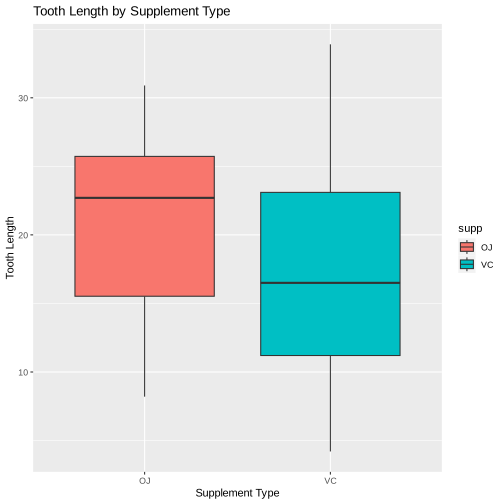
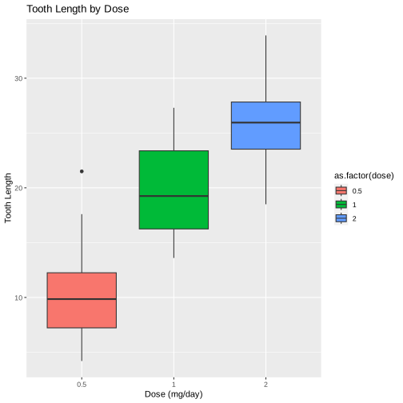
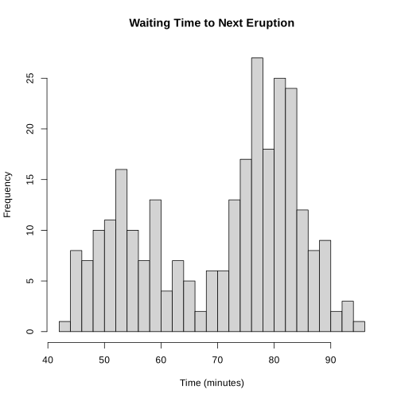
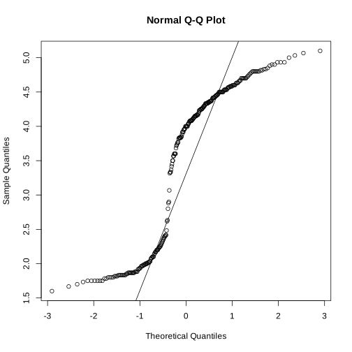
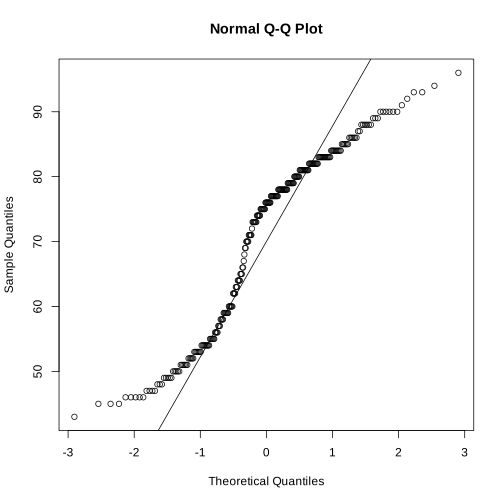

# Main Non-Parametric Methods and Their Uses

Non-parametric methods provide powerful alternatives to parametric tests, especially useful when data do not meet the assumptions required for parametric analyses. Here’s a concise overview of the main types of non-parametric methods and their typical applications:

## 1. Mann-Whitney U Test (Wilcoxon Rank-Sum Test)
- **Description**: Compares the medians between two independent groups.
- **Used When**: You have two unrelated groups and cannot assume the population distributions are normal, or when dealing with ordinal data.
- **R Code**:
  ```r
  wilcox.test(x ~ group, data = df)
  ```

## 2. Wilcoxon Signed-Rank Test
- **Description**: Tests differences between paired observations.
- **Used When**: Dealing with two related samples or matched pairs (e.g., before-after studies) where the normality assumption may not hold.
- **R Code**:
  ```r
  wilcox.test(before, after, paired = TRUE)
  ```

## 3. Kruskal-Wallis Test
- **Description**: An extension of the Mann-Whitney U Test for more than two groups.
- **Used When**: Comparing medians across three or more independent groups without assuming normal distributions.
- **R Code**:
  ```r
  kruskal.test(x ~ group, data = df)
  ```

## 4. Friedman Test
- **Description**: Used for detecting differences in treatments across multiple test attempts.
- **Used When**: Comparing three or more related groups or repeated measures on the same subjects, especially when the data are not normally distributed.
- **R Code**:
  ```r
  friedman.test(x ~ time | subject, data = df)
  ```

## 5. Spearman's Rank Correlation
- **Description**: Measures the strength and direction of association between two ranked variables.
- **Used When**: Assessing the relationship between two variables without assuming a linear relationship or normality in the data.
- **R Code**:
  ```r
  cor.test(x, y, method = "spearman")
  ```

## 6. Chi-Square Test
- **Description**: Tests whether there is a significant association between two categorical variables.
- **Used When**: Analyzing frequency counts and testing independence in a contingency table format.
- **R Code**:
  ```r
  chisq.test(table(df$Var1, df$Var2))
  ```

## Applications and Considerations:
- **Non-normal Data**: Ideal for data that do not meet the normality assumption required by many parametric tests.
- **Ordinal Data**: Suitable for analyses involving ordinal variables or ranks.
- **Small Sample Sizes**: Can be more appropriate than parametric tests in situations with limited data.
- **Outliers and Skewed Distributions**: Robust against outliers and non-symmetrical distributions.


### ToothGrowth Dataset Summary

The `ToothGrowth` dataset in R examines the impact of Vitamin C on tooth growth in guinea pigs. It includes 60 observations across three variables:

- `len`: Length of odontoblasts (measured in micrometers) indicating tooth growth.
- `supp`: Type of Vitamin C supplement given (`OJ` for orange juice, `VC` for ascorbic acid).
- `dose`: Daily Vitamin C dose in milligrams (0.5, 1, and 2 mg/day).

This dataset is useful for statistical analysis, exploring how Vitamin C dosage and supplement type influence tooth growth.


```R
# Load the ToothGrowth data
data("ToothGrowth")

# Load necessary libraries
library(ggplot2)
library(dplyr)
library(tidyr)
```


```R
# Summary statistics
summary(ToothGrowth)
aggregate(len ~ supp + dose, data = ToothGrowth, FUN = function(x) c(mean = mean(x), sd = sd(x)))
```


          len        supp         dose      
     Min.   : 4.20   OJ:30   Min.   :0.500  
     1st Qu.:13.07   VC:30   1st Qu.:0.500  
     Median :19.25           Median :1.000  
     Mean   :18.81           Mean   :1.167  
     3rd Qu.:25.27           3rd Qu.:2.000  
     Max.   :33.90           Max.   :2.000  


<table class="dataframe">
<caption>A data.frame: 6 × 3</caption>
<thead>
	<tr><th scope=col>supp</th><th scope=col>dose</th><th scope=col>len</th></tr>
	<tr><th scope=col>&lt;fct&gt;</th><th scope=col>&lt;dbl&gt;</th><th scope=col>&lt;dbl[,2]&gt;</th></tr>
</thead>
<tbody>
	<tr><td>OJ</td><td>0.5</td><td>13.23, 4.459709</td></tr>
	<tr><td>VC</td><td>0.5</td><td> 7.98, 2.746634</td></tr>
	<tr><td>OJ</td><td>1.0</td><td>22.70, 3.910953</td></tr>
	<tr><td>VC</td><td>1.0</td><td>16.77, 2.515309</td></tr>
	<tr><td>OJ</td><td>2.0</td><td>26.06, 2.655058</td></tr>
	<tr><td>VC</td><td>2.0</td><td>26.14, 4.797731</td></tr>
</tbody>
</table>


```R
## Histogram of tooth lengths
ggplot(ToothGrowth, aes(x = len)) +
  geom_histogram(binwidth = 1, fill = "blue", color = "black") +
  ggtitle("Distribution of Tooth Lengths") +
  xlab("Tooth Length") + ylab("Frequency")
```


    

    


```R
# KDE plot
ggplot(ToothGrowth, aes(x = len)) +
  geom_density(fill = "blue", alpha = 0.5) +
  ggtitle("Kernel Density Estimation of Tooth Lengths") +
  xlab("Tooth Length") + ylab("Density")
```


    

    


```R
ggplot(ToothGrowth, aes(x = supp, y = len, fill = supp)) +
  geom_boxplot() +
  ggtitle("Tooth Length by Supplement Type") +
  xlab("Supplement Type") + ylab("Tooth Length")
```


    

    


```R
ggplot(ToothGrowth, aes(x = as.factor(dose), y = len, fill = as.factor(dose))) +
  geom_boxplot() +
  ggtitle("Tooth Length by Dose") +
  xlab("Dose (mg/day)") + ylab("Tooth Length")

```


    

    


```R
library(dplyr)

ToothGrowth_agg <- ToothGrowth %>%
  group_by(supp, dose) %>%
  summarise(mean_len = mean(len), .groups = "drop")

ggplot(ToothGrowth_agg, aes(x=dose, y=mean_len, group=supp, color=supp)) +
  geom_line() +
  geom_point() +
  labs(title="Mean Tooth Length by Supplement and Dose",
       x="Dose (mg/day)", y="Mean Tooth Length") +
  theme_minimal()


```


    

    


```R
# Normality check with QQ plots
qqnorm(ToothGrowth$len)
qqline(ToothGrowth$len)
```


    

    


```R
# Test normality
shapiro.test(ToothGrowth$len)
```


    
    	Shapiro-Wilk normality test
    
    data:  ToothGrowth$len
    W = 0.96743, p-value = 0.1091


### 1. Comparing Two Independent Groups (Supplement Type)
To compare the tooth length (len) between the two supplement types (supp), you can use the Mann-Whitney U test (also known as the Wilcoxon rank-sum test).


```R
wilcox.test(len ~ supp, data = ToothGrowth)
```

    Warning message in wilcox.test.default(x = DATA[[1L]], y = DATA[[2L]], ...):
    “cannot compute exact p-value with ties”


    
    	Wilcoxon rank sum test with continuity correction
    
    data:  len by supp
    W = 575.5, p-value = 0.06449
    alternative hypothesis: true location shift is not equal to 0


This test compares the median tooth lengths between groups given ascorbic acid (VC) and orange juice (OJ) without assuming the data are normally distributed.

### 2. Comparing More Than Two Independent Groups (Dose Levels)
For comparing the effects of different dose levels (0.5, 1, and 2 mg/day) on tooth length, you can use the Kruskal-Wallis test.


```R
kruskal.test(len ~ dose, data = ToothGrowth)
```


    
    	Kruskal-Wallis rank sum test
    
    data:  len by dose
    Kruskal-Wallis chi-squared = 40.669, df = 2, p-value = 1.475e-09


This test is an extension of the Mann-Whitney U test for more than two groups. It compares the median tooth lengths across different dose levels without assuming normal distribution.

### 3. Analyzing Paired Data
If your data structure included paired observations (which the ToothGrowth dataset does not inherently have, but could if measuring tooth length before and after treatment within the same subjects), you would use the Wilcoxon signed-rank test.


```R
# Hypothetical example if you had pre- and post-treatment measurements
#wilcox.test(preTreatmentLengths, postTreatmentLengths, paired = TRUE)
```

This test compares the median of the paired differences to zero, suitable for before-after studies or matched pairs.

**While non-parametric tests do not assume normality, they still have assumptions (e.g., independence of observations). Always ensure these assumptions are met before proceeding. Additionally, non-parametric tests generally compare medians rather than means, so interpret your results accordingly.**


### Second dataset: Faithful Dataset

The `faithful` dataset comprises 272 observations of Old Faithful geyser in Yellowstone National Park, featuring:

- `eruptions`: Duration of eruptions (minutes).
- `waiting`: Waiting time until the next eruption (minutes).


```R
data("faithful")
summary(faithful)
hist(faithful$eruptions, breaks = 20, main = "Eruption Duration", xlab = "Duration (minutes)")
hist(faithful$waiting, breaks = 20, main = "Waiting Time to Next Eruption", xlab = "Time (minutes)")

```


       eruptions        waiting    
     Min.   :1.600   Min.   :43.0  
     1st Qu.:2.163   1st Qu.:58.0  
     Median :4.000   Median :76.0  
     Mean   :3.488   Mean   :70.9  
     3rd Qu.:4.454   3rd Qu.:82.0  
     Max.   :5.100   Max.   :96.0  


    

    


    

    


```R
qqnorm(faithful$eruptions)
qqline(faithful$eruptions)
```


    

    


```R
qqnorm(faithful$waiting)
qqline(faithful$waiting)
```


    

    


```R
# Shapiro-Wilk test for normality
shapiro.test(faithful$eruptions)
shapiro.test(faithful$waiting)
```


    
    	Shapiro-Wilk normality test
    
    data:  faithful$eruptions
    W = 0.84592, p-value = 9.036e-16


    
    	Shapiro-Wilk normality test
    
    data:  faithful$waiting
    W = 0.92215, p-value = 1.015e-10


#### Suppose you want to compare the eruption durations (eruptions) between short and long waiting times. You first need to categorize the waiting times into two groups. 


```R
# Categorize 'waiting' into two groups
faithful$waiting_group <- ifelse(faithful$waiting < median(faithful$waiting), "Short", "Long")

# Mann-Whitney U test 
wilcox.test(eruptions ~ waiting_group, data = faithful)

```


    
    	Wilcoxon rank sum test with continuity correction
    
    data:  eruptions by waiting_group
    W = 16952, p-value < 2.2e-16
    alternative hypothesis: true location shift is not equal to 0


#### If you had more than two groups and wanted to compare the distributions across those groups, you’d use the Kruskal-Wallis test. For demonstration purposes, let’s simulate a scenario by dividing waiting times into three groups based on quantiles:


```R
# Divide 'waiting' into three groups
faithful$waiting_quantiles <- cut(faithful$waiting, breaks = quantile(faithful$waiting, probs = c(0, 1/3, 2/3, 1)), include.lowest = TRUE, labels = c("Low", "Medium", "High"))

# Kruskal-Wallis test
kruskal.test(eruptions ~ waiting_quantiles, data = faithful)

```


    
    	Kruskal-Wallis rank sum test
    
    data:  eruptions by waiting_quantiles
    Kruskal-Wallis chi-squared = 182.21, df = 2, p-value < 2.2e-16


#### If you want to examine the relationship between the two variables without assuming a linear relationship or normality, use Spearman's rank correlation.


```R
# Spearman correlation
cor.test(faithful$eruptions, faithful$waiting, method = "spearman")

```

    Warning message in cor.test.default(faithful$eruptions, faithful$waiting, method = "spearman"):
    “Cannot compute exact p-value with ties”


    
    	Spearman's rank correlation rho
    
    data:  faithful$eruptions and faithful$waiting
    S = 744659, p-value < 2.2e-16
    alternative hypothesis: true rho is not equal to 0
    sample estimates:
          rho 
    0.7779721 


This means that there's strong evidence to reject the null hypothesis that there's no monotonic relationship between the two variables.


```R
ggplot(faithful, aes(x = waiting, y = eruptions)) +
  geom_point() +
  theme_minimal() +
  labs(title = "Correlation between Eruption Duration and Waiting Time",
       x = "Waiting Time to Next Eruption (minutes)",
       y = "Eruption Duration (minutes)")
```


    

    


```R
ggplot(faithful, aes(x = waiting, y = eruptions)) +
  geom_point() + 
  geom_smooth(method = "lm", color = "blue") + 
  theme_minimal() +
  labs(title = "Correlation between Eruption Duration and Waiting Time with Regression Line",
       x = "Waiting Time to Next Eruption (minutes)",
       y = "Eruption Duration (minutes)")
```

    `geom_smooth()` using formula = 'y ~ x'


    

    


# Weaknesses of Non-Parametric Tests

Non-parametric tests are essential in statistical analysis but come with certain limitations:

- **Lower Statistical Power**: Generally, they have less power than parametric tests, making it harder to detect true effects.

- **Median Comparisons**: Often focus on medians rather than means, which may not always provide the desired insight.

- **Complex Model Limitations**: Less effective for analyzing complex relationships due to simpler modeling capabilities.

- **Reduced Parameter Information**: Provide less information about population parameters, such as mean and variance.

- **Sensitivity to Ties**: The presence of ties in data can affect the test's efficiency and discrimination ability.

- **Interpretation Challenges**: Results can be more difficult to interpret and communicate, especially to non-specialist audiences.

- **Limited Scale**: Primarily suited for ordinal or nominal data, potentially underused information from higher-level scales.


**Note:** The slides used in this class can be found below.

<iframe src="https://docs.google.com/presentation/d/e/2PACX-1vRrSqRMylBsqMtPJnxu6F8aO7u1Xuoq9GoDd1Gxg_PisqoZr_Gra6VEL4l025nVMQ/embed?start=false&loop=false&delayms=3000" frameborder="0" width="640" height="389" allowfullscreen="true" mozallowfullscreen="true" webkitallowfullscreen="true"></iframe>

```R

```
