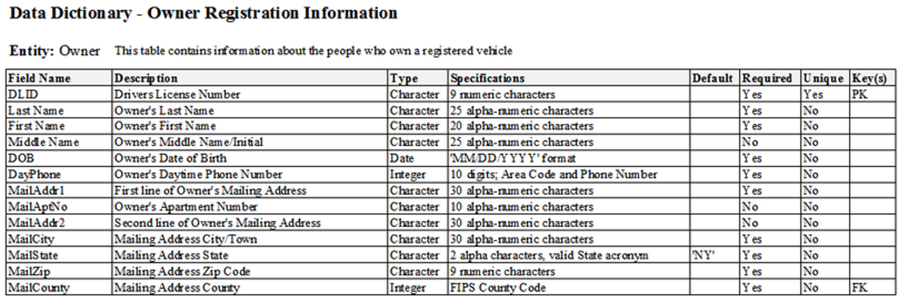

Last Updated: 2023-09-21

## Overview

* Why document your files and data?
* How to document your work:
  * README files
  * Data dictionaries
  * Codebooks
* Create your own README file

## Why Document Your Data?

Documenting data is a key aspect of making your data FAIR (Findable, Accessible, Interoperable, and Reusable).  Not only does it make it easier for others (and your future self!) to find files and navigate directories, but it also helps ensure that data is interpreted correctly.

**Questions to ask yourself**:

* Can you and your collaborators easily find files and interpret them?
* Could people outside of your group be able to find files and interpret them?

## README Files

A README file is one that features information about a project that is necessary to understand a project's files and structures. When working on a project, it can be a guide for you and your collaborators to navigate the project's directories and find files, and be able to understand the content of each file.  Once a project is complete, you might deposit your data into a data repository, which is a digital platform that hosts data and other research materials, and allows others to discover and reuse your work. The README in this case would provide that same level of guidance to people outside of your project team, so it's always good to consider what might be assumed knowledge within your team, and to include any additional details that those unfamiliar with the project might need to interpret the data.

Things to include in a readme file:

* Contact information for the researcher(s)\
* Data collection methods (protocols, sampling, instruments, coverages, etc.)
* The structure of files
* Naming conventions for files, if applicable
* Description of data manipulations or modifications
* Data confidentiality and permissions
* Data use license
* Names of labels and variables and explanations of codes and classifications

Additional best practices include:

* Create README files for logical clusters of related files/data (it's possible you might want to have multiple READMEs for a single project, depending on its complexity and how your projec team is set up)
* If using multiple README files, format them identically
* Write your README as a plain text document (as a .txt or .md file)

### Exercise

Let's take a look at some data!

Becu, Mariella H. J.; Richardson, John S., 2023, "Leaf litter decomposition rates in freshwaters differ by ecosystem", [https://doi.org/10.5683/SP3/HTCIG3](https://doi.org/10.5683/SP3/HTCIG3), Borealis, V1, UNF:6:/uVdlJlVi8MIXK6foNe5tQ== [fileUNF] 

**Look at the README file and at least one of the data files**

* Can you tell what each of the data files is?
* When you look at a data file, can you understand what each of the variables are?
* Is there anything you think is missing from teh README, or do you have questions about other aspects of the data?

## Data Dictionaries

A data dictionary is a tabular (spreadsheet) file that describes each element of tabular datasets. While there can be overlap in the content of a data dictionary that can be included in README files, a data dictionary goes into a bit more detail with respect to defining variable names, labels, units, and constraints such as acceptable range of values. A benefit of having a data dictionary is that it enables software programs, like R or Python, to read and process a data file (enhancing machine-readability), enhancing the interoperability and reuse of the data.  It also provides human-readable details to support discovery, interpretation, and analysis.

[source](https://commons.wikimedia.org/wiki/File:OwnerVehicleDataDictionary.jpg)

### Exercise

Open UBC's Borealis collection, which is UBC's institutional data repository [https://borealisdata.ca/dataverse/ubc](https://borealisdata.ca/dataverse/ubc)

Using the search function, take a look at a few datasets in your field/discipline and think about the following questions:

* What kid of documentation do you see?
* Are there certain approaches to documentation you prefer over others?  Why?

### Exercise

Open Cornell's Guide to Writing "readme" style metadata: [https://data.research.cornell.edu/data-management/sharing/readme/](https://data.research.cornell.edu/data-management/sharing/readme/)

Download the template, and begin filling it out for a current project that you're working on.

