Last Updates: 2023-11-05

> This is a brief introduction. For more in depth examples and solutions, check out [ggplot2: Elegant Graphics for Data Analysis](https://ggplot2-book.org/index.html) by Hadley Wickham, Danielle Navarro, and Thomas Lin Pedersen.

`ggplot()` is based on a grammar graphics -- a way of approaching describing the construction of a graphic from common building blocks. Building a graphic with ggplot then follows some common patterns of construction.

At its most basic, we supply ggplot with a data set and some aesthetics to map -- that is, the variables we wish to display on the plot and how they should appear. We then define a plot type.

Step by step this looks like

1. call ggplot()
2. provide ggplot with a data set
3. provide ggplot with the variable(s) of interest and their aesthetic properties
4. define a plot type with geom_*plotType*()

After this, we continue to add on layers. We can add on additional `geoms`, we can add on scale adjustments, statistical summaries etc. and finally we can adjust how the overall presentation looks, adjusting titles, labels, legends etc. The general form of this is something like:


```r
ggplot() + # call ggplot and potentially feed in data and variables to plot to specific aesthetics
  geom() + # pick a plot type. Data and variables to plot to specific aesthetics can also be assigned here
  scale() + # make adjustments to the scales
  labs() + # customize labels
  ... + # there are other options!
  theme() # add some style
```

## Levels of Measurement & Data Types

We should briefly discuss levels of measurement. A common taxonomy breaks values into four levels:

| Level | Order | Description | Example | General Note |
| :---| :--- | :--- | :--- | :--- |
| Nominal | N | Classifies | Marital status | Pick a category |
| Ordinal | Y | Classifies, > < comparisons | Education | Pick a preference |
| Interval | Y | Difference, - + comparisons | Number of people | Count something |
| Ratio | Y | Magnitude, x / comparisons | Height | Measure something |

Not all visuals are appropriate for all levels. As a consequence, the options available to the various `geoms` that define the plot type will differ.

Reflecting back on our earlier discussion of data types in R, nominal and ordinal data are generally categorical or 'factor', interval will be classified as integers, and ratio will be classified as double. If our data types are not properly assigned, R will often 'coerce' the data type to something that will work, but this isn't always successful, nor is very good practice to make the system guess!

## Get Some Data

First we get some data


```r
library(gapminder)

gapminder <- gapminder
```

## The Basic Graph

Following on the above, first we call ggplot and define our data set:


```r
ggplot(data = gapminder)
```

<!-- -->

A blank slate is prepared for us! Next, we add in the variables we want mapped, selecting here just one year from the data set.


```r
ggplot(data = filter(gapminder, year == 2007), aes(x = gdpPercap, y = lifeExp))
```

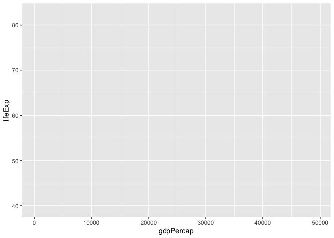<!-- -->

This sets us up with a blank grid with x and y axis ticks corresponding to your variable values and x and y axis labels corresponding to your variables.

Now we call a plot type to represent our data, in this case, a scatter plot


```r
ggplot(data = filter(gapminder, year == 2007), aes(x = gdpPercap, y = lifeExp)) +
  geom_point()
```

<!-- -->

There are several `geoms_` that we can choose from. These include:

* geom_bar() and geom_col() for bar charts
* geom_boxplot() for box and whisker plots
* geom_density() for density plots
* geom_freqpoly(), geom_histogram(), geom_violin(), and geom_dotplot for distributions
* geom_line() for connecting observations
* geom_point() and geom_jitter() for scatter plots
* geom_map() and geom_sf() for GIS data

There are more...

> There are many aesthetics that we can map to `aes()` and each `geom_` will accept different aesthetics. You can review available aesthetics using the help pages. Those aesthetics in **bold** are required.

## Categorical Variables: Basic Bar Chart

ggplot2 offers to geoms for plotting bar charts, `geom_bar()` and `geom_col()`. Use `geom_bar()` when you don't have a count of your categories (it requires a single categorical variable, and passes the operation off to another function that tallies the number of observations associated with each level). And use `geom_col()` when you have a tally per category (it requires two variables to be passed to `aes()`, a categorical variable and a numeric variable.)


```r
# equivalent to the number of countries in each continent in 2007
ggplot(data = filter(gapminder, year == 2007), aes(x = continent)) +
  geom_bar()
```

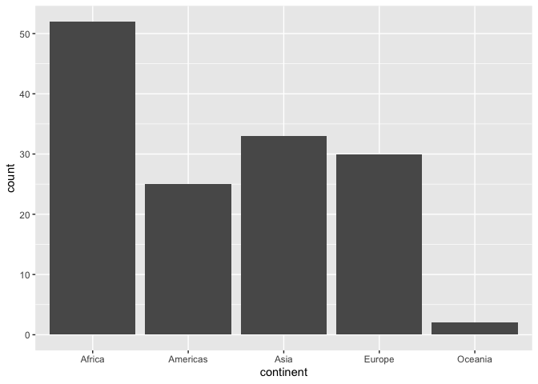<!-- -->

While `geom_bar()` is convenient, you'll likely want a frequency table of corresponding values anyway, which you can the plot with `geom_col()`.
R provides an easy way to get a frequency table with the function `table()`:


```r
country_freqtable <- table(subset(gapminder, year == 2007, select = continent))

country_freqtable
```

```
## continent
##   Africa Americas     Asia   Europe  Oceania 
##       52       25       33       30        2
```

> `NA` values are dropped by default.

`ggplot()` only accepts dataframes and tibbles, so we need to convert out table. Unless we need to preserve our dataframe, we can do this on the fly within our call to `ggplot()`.

> when converting a table to a dataframe, the variable name for the categorical variable is preserved and the count variable is names `Freq`.


```r
ggplot(data = as.data.frame(country_freqtable), aes(x = continent, y = Freq)) +
  geom_col()
```

<!-- -->


## Additional Aesthetics

Beyond articulating the variables on the x and y plane, we can also articulate variables according to other aesthetic properties, such as colour, opacity (alpha), and size.

> Colour can be added with `fill` or `colour`; `fill` fills objects, such as bars on a bar chart, colour produces a line of colour, either, for examples, around a bar chart, or to define the colour of a line, with a point being a section of a line.

Using our scatter plot


```r
ggplot(data = filter(gapminder, year == 2007), aes(x = gdpPercap, y = lifeExp, colour = continent, size = pop)) +
  geom_point()
```

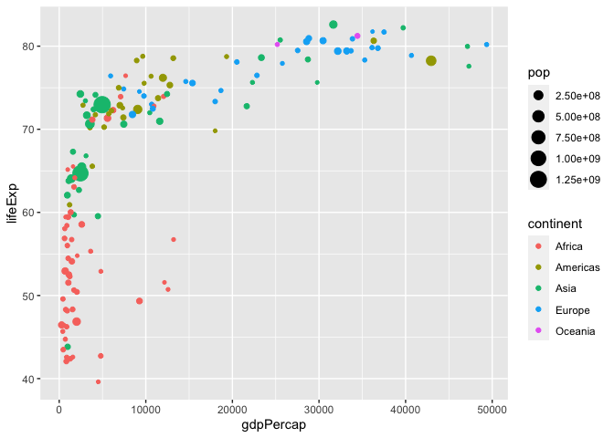<!-- -->

`ggplot2` operating on a grammar of graphics, allows us to do things that are grammatically correct, but don't necessarily make sense, such as mapping size to a categorical variable. It will let you know, however, that something is not quite right.


```r
ggplot(data = filter(gapminder, year == 2007), aes(x = gdpPercap, y = lifeExp, size = continent)) +
  geom_point()
```

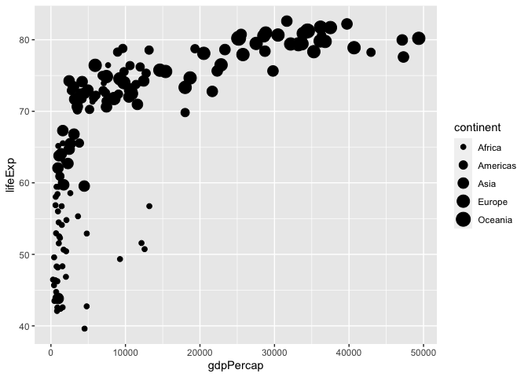<!-- -->

Colour, opacity, and size can be asigned either as a scale, where each value takes on a different property, or as general property of the variable. The former is articulated within the `aes()` call, while the latter is articulated outside of this call, generally within the geom. The latter will override the former if both are articulated. See, for example, the difference in the following plots.


```r
# colour and size mapped to values
ggplot(data = filter(gapminder, year == 2007), aes(x = gdpPercap, y = lifeExp, colour = continent, size = pop)) +
  geom_point()
```

<!-- -->

```r
# colour mapped to continent values, size to the geom
ggplot(data = filter(gapminder, year == 2007), aes(x = gdpPercap, y = lifeExp, colour = continent)) +
  geom_point(size = 5)
```

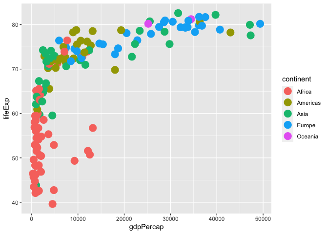<!-- -->

```r
# colour and size mapped to values, but overriden by also being mapped to the geom, note also the loss of the legend
ggplot(data = filter(gapminder, year == 2007), aes(x = gdpPercap, y = lifeExp, colour = continent, size = pop)) +
  geom_point(size = 5, colour = 'pink')
```

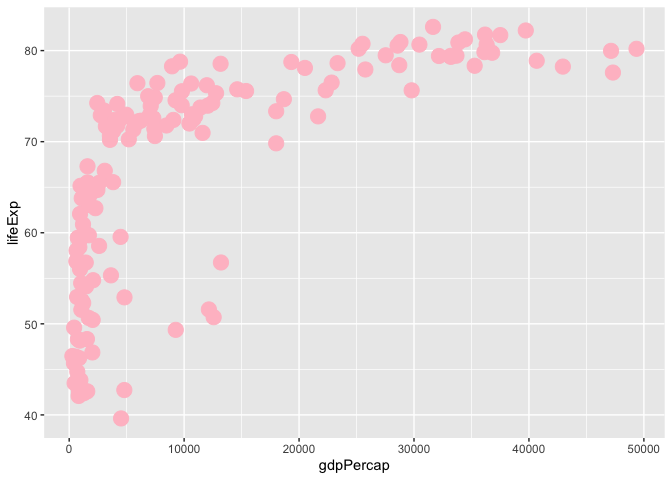<!-- -->

## Scales

Our scales, or how are variables are mapped, can be adjusted in many different ways. There are scale adjustments for the variables mapped to fill, colour, alpha, size, x, and y.

For colour, we'll use a common library `RColorBrewer`


```r
install.packages("RColorBrewer")
library(RColorBrewer)
```

To view the colour palettes available from this package...


```r
display.brewer.all()
```

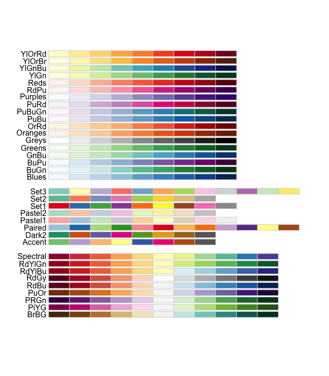<!-- -->

In the following, we re-map the size range, the colour range, and apply a log transformation to the x-axis variable...


```r
ggplot(data = filter(gapminder, year == 2007), aes(x = gdpPercap, y = lifeExp, colour = continent, size = pop)) +
  geom_point() +
  scale_size(range = c(1,15)) +
  scale_colour_brewer(palette = "Dark2") +
  scale_x_log10()
```

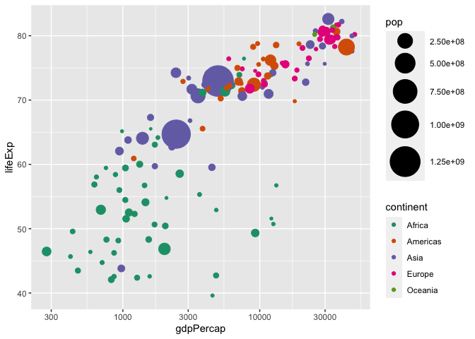<!-- -->

## Labeling, titles, and captions

Labels--on the x and y axis, as well as on the other mappings (size, colour, fill, alpha, etc.)--default to our variable names, which may not be what we want on our graph. Titles and captions are by default blank. We can override this with `labs()`.


```r
ggplot(data = filter(gapminder, year == 2007), aes(x = gdpPercap, y = lifeExp, colour = continent, size = pop)) +
  geom_point() +
  scale_size(range = c(1,15)) +
  scale_colour_brewer(palette = "Dark2") +
  scale_x_log10() +
  labs(x = "GDP per Capita (2007",
       y = "Life Expectancy",
       title = "Gapminder 2007",
       caption = "2007 life expectancy plotted against per capita GDP.",
       colour = "Continent",
       size = "Population")
```

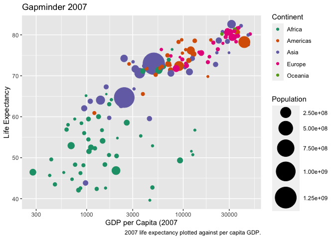<!-- -->

x and y axis ticks and text are auto generated. The scale options allow us to customize these, however. To do this, we need the `scales` library, which is automatically isntalled when `ggplot2` is installed. We can access scales either by loading the library...


```r
library(scales)
```

Or by referencing it directly, which has the additional benefit of prompting auto complete options. Here, we adjust the x axis to indicate that the data should be formatted as a currency, and update the ticks to appear every $10 000, better indicating that we've applied a log transformation to the variable.


```r
ggplot(data = filter(gapminder, year == 2007), aes(x = gdpPercap, y = lifeExp, colour = continent, size = pop)) +
  geom_point() +
  scale_size(range = c(1,15)) +
  scale_colour_brewer(palette = "Dark2") +
  scale_x_log10(labels = scales::dollar_format(),
                breaks = breaks_width(10000)) +
  labs(x = "GDP per Capita (2007",
       y = "Life Expectancy",
       title = "Gapminder 2007",
       caption = "2007 life expectancy plotted against per capita GDP.",
       colour = "Continent",
       size = "Population")
```

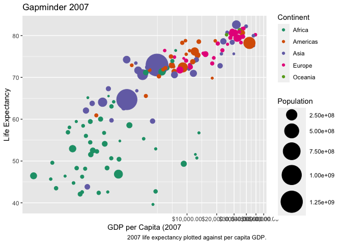<!-- -->

## Tweaking the presentation

ggplot offers a lot of flexibility in how we customize the visual appeal of our plots; these are controlled by arguments passed to theme. There are also several built in themes that can be used and modified.


```r
ggplot(data = filter(gapminder, year == 2007), aes(x = gdpPercap, y = lifeExp, colour = continent, size = pop)) +
  geom_point() +
  scale_size(range = c(1,15)) +
  scale_colour_brewer(palette = "Dark2") +
  scale_x_log10(labels = scales::dollar_format(),
                breaks = breaks_width(10000)) +
  labs(x = "GDP per Capita (2007",
       y = "Life Expectancy",
       title = "Gapminder 2007",
       caption = "2007 life expectancy plotted against per capita GDP.",
       colour = "Continent",
       size = "Population") +
  theme_minimal()
```

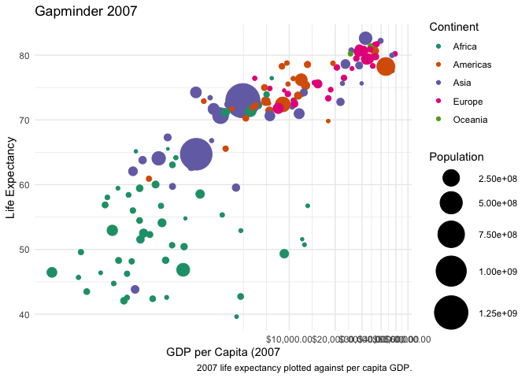<!-- -->

By calling theme, you can then access any element and customize it further. The call works by first identifying the element to customize--auto complete will present you a series of options--then indicating what aspect of that element you want to customize, and finally providing arguments.


```r
ggplot(data = filter(gapminder, year == 2007), aes(x = gdpPercap, y = lifeExp, colour = continent, size = pop)) +
  geom_point() +
  scale_size(range = c(1,15)) +
  scale_colour_brewer(palette = "Dark2") +
  scale_x_log10(labels = scales::dollar_format(),
                breaks = breaks_width(10000)) +
  labs(x = "GDP per Capita (2007",
       y = "Life Expectancy",
       title = "Gapminder 2007",
       caption = "2007 life expectancy plotted against per capita GDP.",
       colour = "Continent",
       size = "Population") +
  theme_minimal() +
  theme(
    axis.text.x = element_text(angle = 45),
    legend.position = "left",
    panel.grid.minor = element_blank()
  )
```

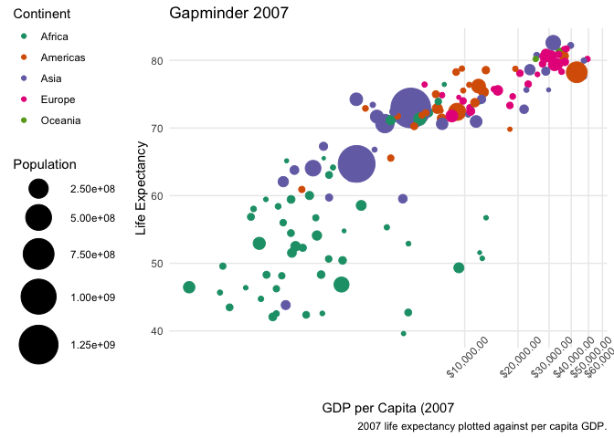<!-- -->

## Statisical overlays & multiple geoms

We can overlay our plot with additional geoms. Some of the geoms available are models.


```r
ggplot(data = filter(gapminder, year == 2007), aes(x = gdpPercap, y = lifeExp, colour = continent, size = pop)) +
  geom_point() +
  geom_smooth(method = "lm", se = FALSE) +
  scale_size(range = c(1,15)) +
  scale_colour_brewer(palette = "Dark2") +
  scale_x_log10(labels = scales::dollar_format(),
                breaks = breaks_width(10000)) +
  labs(x = "GDP per Capita (2007",
       y = "Life Expectancy",
       title = "Gapminder 2007",
       caption = "2007 life expectancy plotted against per capita GDP.",
       colour = "Continent",
       size = "Population") +
  theme_minimal() +
  theme(
    axis.text.x = element_text(angle = 45),
    legend.position = "left",
    panel.grid.minor = element_blank()
  )
```

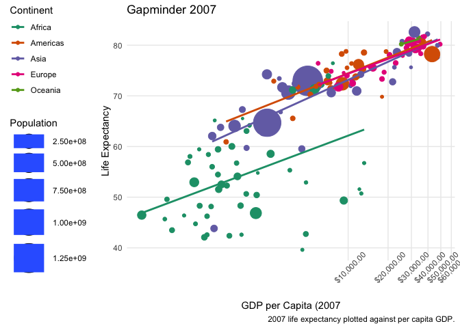<!-- -->

This result is a little odd. We can better articulate our data within the representation, by passing the x and y variables to ggplot, but the colour and size variables to a specific geom. This way, only `gdpPercap` and `lifeExp` get passed to `geom_smooth()`.


```r
ggplot(data = filter(gapminder, year == 2007), aes(x = gdpPercap, y = lifeExp)) +
  geom_point(aes(colour = continent, size = pop)) +
  geom_smooth(method = "lm", se = FALSE) +
  scale_size(range = c(1,15)) +
  scale_colour_brewer(palette = "Dark2") +
  scale_x_log10(labels = scales::dollar_format(),
                breaks = breaks_width(10000)) +
  labs(x = "GDP per Capita (2007",
       y = "Life Expectancy",
       title = "Gapminder 2007",
       caption = "2007 life expectancy plotted against per capita GDP.",
       colour = "Continent",
       size = "Population") +
  theme_minimal() +
  theme(
    axis.text.x = element_text(angle = 45),
    legend.position = "left",
    panel.grid.minor = element_blank()
  )
```

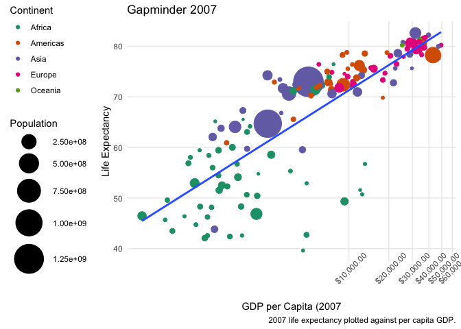<!-- -->

You can plot as many geoms as you'd like.

## More than one plot

There are several ways to place more than one plot side by side. The first is to facet an existing plot with either `facet_wrap()` or `facet_grid()`.


```r
ggplot(data = filter(gapminder, year == 2007), aes(x = gdpPercap, y = lifeExp)) +
  geom_point(aes(colour = continent, size = pop)) +
  geom_smooth(method = "lm", se = FALSE) +
  scale_size(range = c(1,15)) +
  scale_colour_brewer(palette = "Dark2") +
  scale_x_log10(labels = scales::dollar_format(),
                breaks = breaks_width(10000)) +
  labs(x = "GDP per Capita (2007",
       y = "Life Expectancy",
       title = "Gapminder 2007",
       caption = "2007 life expectancy plotted against per capita GDP.",
       colour = "Continent",
       size = "Population") +
  theme_minimal() +
  theme(
    axis.text.x = element_text(angle = 45),
    legend.position = "left",
    panel.grid.minor = element_blank()
  ) +
  facet_wrap(~ continent)
```

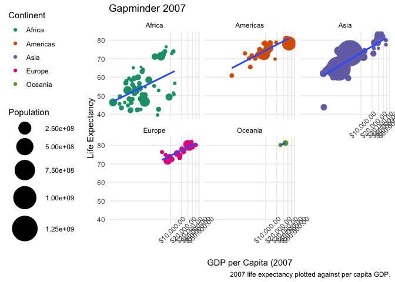<!-- -->

The second is to print several plots in a specific arrangement. There are several tools to do this, one of which is `patchwork`.


```r
install.packages("patchwork")
library(patchwork)
```

To use patchwork, we store plots within variables, and then use basic operators to define their relationship. Pathcwork offers a lot of customization.


```r
le_gdp_scatter <- ggplot(data = filter(gapminder, year == 2007), aes(x = gdpPercap, y = lifeExp)) +
  geom_point(aes(colour = continent, size = pop)) +
  geom_smooth(method = "lm", se = FALSE) +
  scale_size(range = c(1,15)) +
  scale_colour_brewer(palette = "Dark2") +
  scale_x_log10(labels = scales::dollar_format(),
                breaks = breaks_width(10000)) +
  labs(x = "GDP per Capita (2007",
       y = "Life Expectancy",
       title = "Gapminder 2007",
       caption = "2007 life expectancy plotted against per capita GDP.",
       colour = "Continent",
       size = "Population") +
  theme_minimal() +
  theme(
    axis.text.x = element_text(angle = 45),
    legend.position = "left",
    panel.grid.minor = element_blank()
  )

le_gdp_box <- ggplot(data = filter(gapminder, year == 2007), aes(x = continent, y = lifeExp)) +
  geom_boxplot(aes(fill = continent)) +
  scale_fill_brewer(palette = "Dark2") +
  theme_minimal() +
  theme(
    legend.position = "none"
  )

le_gdp_scatter + le_gdp_box
```

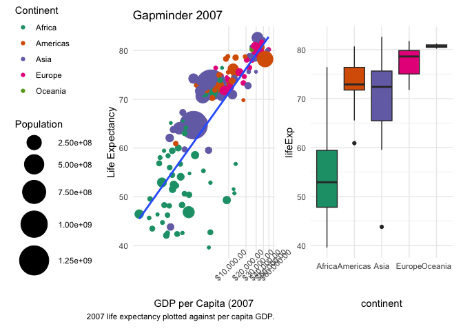<!-- -->

```r
le_gdp_scatter / le_gdp_box
```

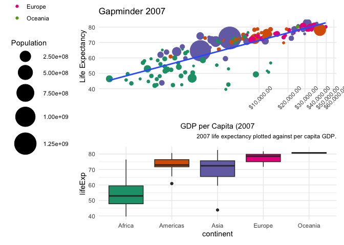<!-- -->
