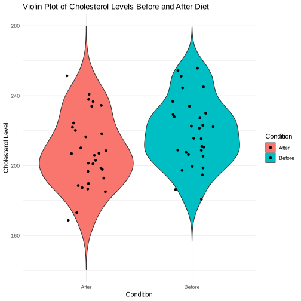

# Types of T-Tests: A Concise Overview

T-tests are statistical methods used to assess if there's a significant difference in means between groups. These tests cater to different study designs and assumptions:

## 1. One-Sample T-Test
- **Purpose**: Compares a single sample's mean to a population mean or theoretical value.
- **Example**: Evaluating if a class's average height is different from the national average.

## 2. Independent Two-Sample T-Test
- **Purpose**: Assesses if two independent groups' means significantly differ.
- **Subtypes**:
  - **Equal Variance**: Assumes same variance across both groups.
  - **Unequal Variance (Welch's T-Test)**: Does not require equal variance.
- **Example**: Comparing test scores between students from two schools.

## 3. Paired T-Test
- **Purpose**: Compares means of two related groups to identify significant differences.
- **Example**: Checking blood pressure changes in patients before and after a medication.

## Key Considerations
- **Data Assumptions**: Assumes data are roughly normally distributed.
- **Sample Independence**: Required for the independent two-sample t-test; not applicable for the paired t-test where samples are inherently related.
- **Variance Assumptions**: Critical for choosing between equal and unequal variance tests in independent samples; not relevant for paired tests.

Selecting the right t-test depends on the study design, sample relationship, and hypothesis. Understanding these elements is essential for accurate result interpretation.


### One-Sample T-Test
**Scenario**: A nutritionist wants to evaluate the effectiveness of a newly formulated protein bar designed to aid in muscle recovery. They claim that consuming this protein bar daily improves muscle recovery speed by reducing recovery time significantly below the industry standard of 48 hours.

* One-Tailed Test: The nutritionist hypothesizes that the recovery time for athletes using the protein bar is less than 48 hours. This scenario warrants a one-tailed test because the hypothesis specifies a direction (improvement means a decrease in recovery time).


```R
library(ggplot2)

set.seed(123)
recovery_times <- rnorm(30, mean = 46, sd = 5)

t_test_result <- t.test(recovery_times, mu = 48, alternative = "less")

print(t_test_result)

ggplot(data.frame(RecoveryTime = recovery_times), aes(x = factor(1), y = RecoveryTime)) +
  geom_violin(trim = FALSE, fill = "lightblue") +
  geom_jitter(width = 0.1, color = "darkblue") +
  labs(title = "Violin Plot of Recovery Times",
       x = "",
       y = "Recovery Time (hours)") +
  theme_minimal()

```


    	One Sample t-test

    data:  recovery_times
    t = -2.4962, df = 29, p-value = 0.009243
    alternative hypothesis: true mean is less than 48
    95 percent confidence interval:
         -Inf 47.28614
    sample estimates:
    mean of x
     45.76448


* Two-Tailed Test: If the nutritionist wants to test whether the protein bar affects recovery time without specifying the direction of the effect (i.e., it could either decrease or increase recovery time), a two-tailed test is used.


```R
t.test(recovery_times, mu = 48, alternative = "two.sided")
```


    	One Sample t-test

    data:  recovery_times
    t = -2.4962, df = 29, p-value = 0.01849
    alternative hypothesis: true mean is not equal to 48
    95 percent confidence interval:
     43.93287 47.59610
    sample estimates:
    mean of x
     45.76448


### Independent Two-Sample T-Test
**Scenario**: An exercise physiologist conducts a study to compare the effectiveness of two different strength training programs (Program A and Program B) on improving squat strength. Participants are randomly assigned to one of the two programs.

* Two-Tailed Test: If the hypothesis is that there is a difference in effectiveness between the two programs without specifying which one is expected to be better, a two-tailed test is appropriate.


```R
set.seed(123)
strength_gains_a <- rnorm(30, mean = 20, sd = 5)
strength_gains_b <- rnorm(30, mean = 15, sd = 5)

t_test_result <- t.test(strength_gains_a, strength_gains_b, alternative = "two.sided")


df_strength <- data.frame(Group = factor(rep(c("Program A", "Program B"), each = 30)),
                          StrengthGain = c(strength_gains_a, strength_gains_b))

ggplot(df_strength, aes(x = Group, y = StrengthGain, fill = Group)) +
  geom_violin(trim = FALSE) +
  geom_jitter(width = 0.2, color = "black") +
  labs(title = "Violin Plot of Strength Gains by Program",
       x = "Group",
       y = "Strength Gain") +
  theme_minimal()

```


* One-Tailed Test: The hypothesis is that Program A results in greater strength gains than Program B. This is a one-tailed test because the hypothesis specifies that one program is superior to the other in increasing squat strength.


```R
t.test(strength_gains_a, strength_gains_b, alternative = "greater")
```


    	Welch Two Sample t-test

    data:  strength_gains_a and strength_gains_b
    t = 3.2929, df = 56.559, p-value = 0.0008566
    alternative hypothesis: true difference in means is greater than 0
    95 percent confidence interval:
     1.906059      Inf
    sample estimates:
    mean of x mean of y
     19.76448  15.89169


### Paired T-Test
**Scenario**: A dietitian investigates the effect of a special diet plan on reducing cholesterol levels. For this, they measure the cholesterol levels of participants before starting the diet and again after 12 weeks on the diet.


* Two-Tailed Test: If the dietitian wants to test for any change in cholesterol levels without specifying the direction (i.e., the levels could either increase or decrease), they would use a two-tailed test.


```R

set.seed(123)
before <- rnorm(30, mean = 220, sd = 20)
after <- before - rnorm(30, mean = 10, sd = 5)

t_test_result <- t.test(before, after, paired = TRUE, alternative = "two.sided")

df_cholesterol <- data.frame(Condition = factor(rep(c("Before", "After"), each = 30)),
                             Cholesterol = c(before, after))

ggplot(df_cholesterol, aes(x = Condition, y = Cholesterol, fill = Condition)) +
  geom_violin(trim = FALSE) +
  geom_jitter(width = 0.2, color = "black") +
  labs(title = "Violin Plot of Cholesterol Levels Before and After Diet",
       x = "Condition",
       y = "Cholesterol Level") +
  theme_minimal()

```





* One-Tailed Test: The dietitian hypothesizes that the diet will lead to a reduction in cholesterol levels. This scenario suits a one-tailed test since the expected direction of effect is specified (a decrease in cholesterol levels).


```R
t.test(before, after, paired = TRUE, alternative = "less")

```


    	Paired t-test

    data:  before and after
    t = 14.287, df = 29, p-value = 1
    alternative hypothesis: true mean difference is less than 0
    95 percent confidence interval:
         -Inf 12.18704
    sample estimates:
    mean difference
           10.89169


**Scenario**: Examining the Effectiveness of Two Teaching Methods on Student Performance

Imagine a school is testing the effectiveness of two different teaching methods for improving students' math test scores. Method A is a traditional lecture-based approach, while Method B incorporates interactive, problem-based learning. Two independent groups of students are taught using these respective methods, and their performances are evaluated through a standardized test.

* With Equal Variances Assumed

Let's assume we have preliminary data or domain knowledge suggesting that the variation in test scores within each teaching method group is similar. This assumption of equal variances allows us to use the standard independent two-sample t-test.


```R
set.seed(123)
scores_method_a <- rnorm(30, mean = 75, sd = 10)  # Group A
scores_method_b <- rnorm(30, mean = 80, sd = 10)  # Group B

t_test_equal_var <- t.test(scores_method_a, scores_method_b, var.equal = TRUE)
t_test_equal_var

```


    	Two Sample t-test

    data:  scores_method_a and scores_method_b
    t = -3.0841, df = 58, p-value = 0.003125
    alternative hypothesis: true difference in means is not equal to 0
    95 percent confidence interval:
     -11.962870  -2.545972
    sample estimates:
    mean of x mean of y
     74.52896  81.78338


* Without Equal Variances Assumed (Welch’s T-Test)

Later, suppose another set of scores is collected under slightly different conditions, or further analysis suggests that the assumption of equal variances between the two groups may not hold. In this case, Welch's t-test, which does not assume equal variances, is more appropriate.


```R
set.seed(123)
scores_method_a_adj <- rnorm(30, mean = 75, sd = 12)
scores_method_b_adj <- rnorm(30, mean = 80, sd = 8)

t_test_unequal_var <- t.test(scores_method_a_adj, scores_method_b_adj, var.equal = FALSE)
t_test_unequal_var

```


    	Welch Two Sample t-test

    data:  scores_method_a_adj and scores_method_b_adj
    t = -2.8292, df = 45.925, p-value = 0.006896
    alternative hypothesis: true difference in means is not equal to 0
    95 percent confidence interval:
     -11.966709  -2.017195
    sample estimates:
    mean of x mean of y
     74.43475  81.42671


| Feature | One-Sample T-Test | Independent Two-Sample T-Test | Paired T-Test |
|---------|-------------------|-------------------------------|---------------|
| **Purpose** | Compare the mean of a single group to a known value or population mean. | Compare the means of two independent groups to see if there is a statistically significant difference. | Compare the means of two related groups to assess if there is a statistically significant change. |
| **Data Structure** | Single sample of data. | Two samples of data from two groups. | Two sets of measurements taken from the same group at different times or under different conditions. |
| **Hypothesis** | Can test if the sample mean is significantly different from the known value (greater, less, or both). | Can test if one group mean is significantly greater, less, or simply different from the other group mean. | Tests if the mean difference between paired observations is significantly different from zero (or a theoretical difference). |
| **One-Tailed Test** | Tests if the sample mean is significantly greater than or less than the known value. | Tests if one group's mean is significantly greater than or less than the other group's mean. | Tests if the mean difference is significantly greater than or less than zero (or a theoretical difference). |
| **Two-Tailed Test** | Tests if there is any significant difference between the sample mean and the known value, regardless of direction. | Tests if there is any significant difference between the means of the two groups, regardless of which is higher. | Tests if there is any significant change in means between the two conditions, without specifying the direction of change. |
| **Assumptions** | Data should be normally distributed. | Both groups' data should be normally distributed, have similar variances, and be independently sampled. | Differences between paired observations should be normally distributed. |
| **Use Case** | Checking if a process improvement led to changes in average output, comparing a sample mean against a global average, etc. | Comparing the effects of two different treatments, conditions, or groups (e.g., control vs. experimental group). | Before-and-after comparisons, matched subjects in a study, repeated measurements on the same subjects (e.g., before and after a treatment). |
| **Similarities** | - All involve hypothesis testing and use of t-statistics.


# What if your data is not normal: Non-Parametric Alternatives to the T-Test

Non-parametric tests are used when data do not meet the assumptions required for parametric tests like the t-test. Here's a concise summary of the non-parametric counterparts for each type of t-test:

## 1. One-Sample and Paired T-Test
- **Wilcoxon Signed-Rank Test**
  - **Use Case**: When comparing related samples or a single sample against a known median.
  - **R Code**: `wilcox.test(x, y, paired = TRUE)` for paired samples; `wilcox.test(x, mu)` for one sample.

## 2. Independent Two-Sample T-Test
- **Mann-Whitney U Test** (Wilcoxon Rank-Sum Test)
  - **Use Case**: For comparing two independent samples without assuming normal distribution.
  - **R Code**: `wilcox.test(x, y, paired = FALSE)`

## Key Characteristics
- **Flexibility**: Do not require the assumption of normal distribution.
- **Applicability**: Suitable for ordinal data or non-normally distributed interval/ratio data.
- **Limitations**: May be less powerful than parametric tests if the parametric assumptions are met.

These non-parametric tests provide robust alternatives to t-tests, especially useful for small samples or data with significant skewness or outliers.


**Note:** The slides used in this class can be found below.

<iframe src="https://docs.google.com/presentation/d/e/2PACX-1vQDqXrk2UH6G6pMP_CvMVv9zfxphKXJy6cj7q7wgMdcmyhNVS_PeTCPP8LkLBYOxg/embed?start=false&loop=false&delayms=3000" frameborder="0" width="640" height="389" allowfullscreen="true" mozallowfullscreen="true" webkitallowfullscreen="true"></iframe>

```R

```
