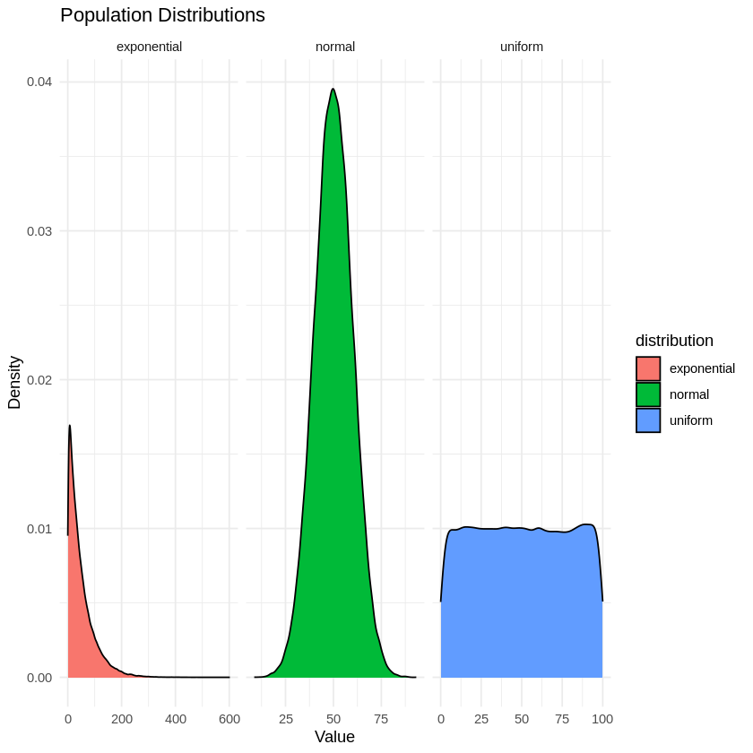
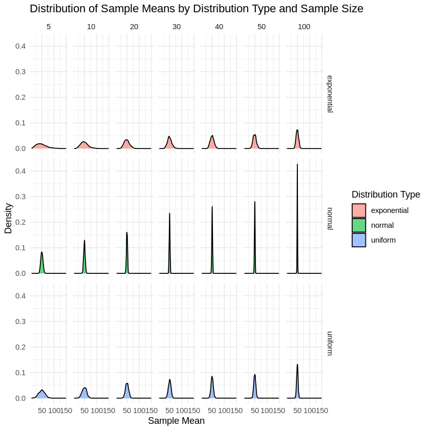

# Statistical Distribution and Central Limit Theorem

## Introduction
This workshop covers the basics of generating and visualizing statistical distributions in R using the `tidyverse` package. We will create three different distributions (normal, uniform, and exponential) and visualize them using kernel density plots.


**Quick Overview**
* The CLT states that if you take sufficiently large random samples from any population (no matter the shape of the population's distribution), the distribution of the sample means will approximate a normal distribution (a bell-shaped curve). This approximation becomes better as the sample size increases.
* When you take a sample from a population and calculate its mean (average), you get a sample mean. The CLT is about the distribution of these sample means, not the distribution of individual data points in the population.
* This theorem is powerful because it allows statisticians to make inferences about population parameters (like the mean) using sample data, even when the population is not normally distributed. It's the foundation for many statistical methods and hypothesis tests.
* For the CLT to hold, the samples need to be:
    1. Randomly selected.
    2. Large enough (usually sample sizes greater than 30 are considered sufficient, but this can vary).
    3. Independent from each other (the selection of one sample should not influence the selection of another).
* The normal distribution is a probability distribution that is symmetric about the mean. The CLT explains why many processes and measurements in nature and social sciences tend to follow this normal distribution when averaged over many instances.

#### Importance of CLT
- **Inferences About Populations**: Allows for population-wide inferences from sample data, more practical than studying entire populations.
- **Applicable to Various Populations**: Effective for populations with any distribution shape, given a large sample size.
- **Supports Parametric Tests**: Underpins many parametric tests by supporting the normal distribution assumption.
- **Simplifies Data Analysis**: Transforms complex data into a manageable normal distribution.
- **Decision Making in Uncertainty**: Provides a statistical framework for decision-making under uncertainty.

### 1: Setup and Population Generation

**Loading Package**: Let's load the tidyverse package, a collection of R packages for data science, including data manipulation and visualization tools.


```R
# Check if tidyverse is installed and install it if not
if (!requireNamespace("tidyverse", quietly = TRUE)) {
  install.packages("tidyverse")
}

# Load the tidyverse package
library(tidyverse)
```

    Warning message:
    “package ‘dplyr’ was built under R version 4.3.2”
    Warning message:
    “package ‘stringr’ was built under R version 4.3.2”
    ── Attaching core tidyverse packages ──────────────────────── tidyverse 2.0.0 ──
    ✔ dplyr     1.1.4     ✔ readr     2.1.4
    ✔ forcats   1.0.0     ✔ stringr   1.5.1
    ✔ ggplot2   3.4.4     ✔ tibble    3.2.1
    ✔ lubridate 1.9.3     ✔ tidyr     1.3.0
    ✔ purrr     1.0.2     
    ── Conflicts ────────────────────────────────────────── tidyverse_conflicts() ──
    ✖ dplyr::filter() masks stats::filter()
    ✖ dplyr::lag()    masks stats::lag()
    ℹ Use the conflicted package (<http://conflicted.r-lib.org/>) to force all conflicts to become errors


**Setting a Seed**: Ensures reproducibility of results. The set.seed(123) function sets the random number generator to a fixed sequence.


```R
# Set seed for reproducibility
set.seed(123)
```

**Defining Population Size**: Sets the number of data points for each distribution (population_size = 100,000).


```R
# Define the population size
population_size <- 100000
```

**Generating Populations**: Creates three different distributions: normal, uniform, and exponential, each with 100,000 data points.


```R
# Generate populations
populations <- tibble(
  normal = rnorm(population_size, mean = 50, sd = 10),
  uniform = runif(population_size, min = 0, max = 100),
  exponential = rexp(population_size, rate = 0.02)
)
```

Now let's look at the first 5 rows of the tibble.


```R
head(populations)
```


<table class="dataframe">
<caption>A tibble: 6 × 3</caption>
<thead>
	<tr><th scope=col>normal</th><th scope=col>uniform</th><th scope=col>exponential</th></tr>
	<tr><th scope=col>&lt;dbl&gt;</th><th scope=col>&lt;dbl&gt;</th><th scope=col>&lt;dbl&gt;</th></tr>
</thead>
<tbody>
	<tr><td>44.39524</td><td>60.44927</td><td>29.292887</td></tr>
	<tr><td>47.69823</td><td>51.97372</td><td>74.372971</td></tr>
	<tr><td>65.58708</td><td>96.64309</td><td> 1.807305</td></tr>
	<tr><td>50.70508</td><td>80.39748</td><td>10.901159</td></tr>
	<tr><td>51.29288</td><td>47.63254</td><td> 1.336612</td></tr>
	<tr><td>67.15065</td><td>89.03851</td><td>47.032041</td></tr>
</tbody>
</table>


**Reshaping Data**: Transforms the data into a long format, with a new column for distribution types and their values, suitable for ggplot.


```R
# Reshape for plotting
populations_long <- populations %>%
  pivot_longer(cols = everything(), names_to = "distribution", values_to = "value")
```


```R
head(populations_long)
```


<table class="dataframe">
<caption>A tibble: 6 × 2</caption>
<thead>
	<tr><th scope=col>distribution</th><th scope=col>value</th></tr>
	<tr><th scope=col>&lt;chr&gt;</th><th scope=col>&lt;dbl&gt;</th></tr>
</thead>
<tbody>
	<tr><td>normal     </td><td>44.39524</td></tr>
	<tr><td>uniform    </td><td>60.44927</td></tr>
	<tr><td>exponential</td><td>29.29289</td></tr>
	<tr><td>normal     </td><td>47.69823</td></tr>
	<tr><td>uniform    </td><td>51.97372</td></tr>
	<tr><td>exponential</td><td>74.37297</td></tr>
</tbody>
</table>


**Plotting Distributions**: Uses ggplot to create kernel density plots, with different facets for each distribution.


```R
# Plot the populations using kernel density plots
ggplot(populations_long, aes(x = value, fill = distribution)) +
  geom_density() +
  facet_wrap(~ distribution, scales = "free_x") +
  labs(title = "Population Distributions", x = "Value", y = "Density") +
  theme_minimal()
```





### 2.Simulating Central Limit Theorem

**Defining a Custom Function**: sample_means is a user-defined function that takes two arguments: a population (a vector of data) and a sample_size (an integer).


```R
# Function to take samples and compute means
sample_means <- function(population, sample_size) {
  replicate(1000, mean(sample(population, sample_size)))
}
```

**Setting up sample sizes** : This following creates a vector sample_sizes containing different sizes. These sizes represent the number of data points in each sample that will be drawn from the populations.


```R
# Sample sizes for more intervals
sample_sizes <- c(5, 10, 20, 30, 40, 50, 100)
```

**Replication for Robustness**: Within the function, replicate(1000, ...) is used to repeat a process 1000 times, enhancing the statistical robustness of the results.
**Sampling and Mean Calculation**: In each repetition, the function randomly samples sample_size elements from population and calculates their mean. The result is an array of 1000 sample means.


```R
# Generate sample means data
sample_means_data <- map_df(sample_sizes, function(size) {
  map_df(populations, sample_means, sample_size = size)
}) %>%
  pivot_longer(cols = everything(), names_to = "distribution", values_to = "value") %>%
  mutate(size = factor(rep(sample_sizes, each = 3000), levels = sample_sizes))
```

#### Applying Function Across Sample Sizes
- `map_df` is used to apply the `sample_means` function across all values in `sample_sizes`.
- For each specified sample size, `sample_means` is further applied to each distribution in the `populations` dataframe.

#### Data Transformation
- The `pivot_longer` function converts the data into a long format, which is more suitable for visualization.
- The `mutate` function is used to add a new column named `size`. This column categorizes each mean by its corresponding sample size.

#### Creating a Dataset
- The output is a dataframe named `sample_means_data`.
- Each row in this dataframe represents a sample mean. It also includes the associated distribution type and sample size for each sample mean.


**Plotting the Data**:


```R
# Plotting the distributions of sample means using kernel density plots
# Faceted by both distribution type and sample size
ggplot(sample_means_data, aes(x = value, fill = distribution)) +
  geom_density(alpha = 0.6) +
  facet_grid(distribution ~ size) +
  labs(title = "Distribution of Sample Means by Distribution Type and Sample Size",
       x = "Sample Mean",
       y = "Density") +
  theme_minimal() +
  guides(fill = guide_legend(title = "Distribution Type"))
```





## References

1. **Tidyverse Package**: Wickham, H. et al. (2019). Welcome to the tidyverse. _Journal of Open Source Software, 4(43), 1686_. [https://doi.org/10.21105/joss.01686](https://doi.org/10.21105/joss.01686)  

2. **The R Project**: R Core Team. _The R Project for Statistical Computing_. [https://www.r-project.org/](https://www.r-project.org/)  

3. **R Manuals**: R Core Team. _An Introduction to R_. [https://cran.r-project.org/manuals.html](https://cran.r-project.org/manuals.html)

4. **Understanding the Central Limit Theorem**: Rice, J. A. (2007). _Mathematical Statistics and Data Analysis_ (3rd ed.). Duxbury Press.


```R

```


```R

```
