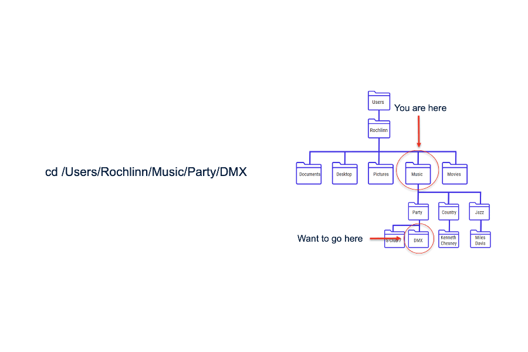

```{r setup, include = FALSE}
knitr::opts_chunk$set(echo = TRUE,
                      eval = TRUE,
                      attr.source = 'custom-style="CodeDark"')
library(flextable) # for creating ppt-friendly flextables
library(dplyr)
library(tibble)
library(here)
options(tidyverse.quiet = TRUE)

```

~~~{=comment}
#
#
#
What is R broad overview section.
#
#
#
~~~

# R vs SPSS 

```{r echo = FALSE}
tbl <- tibble::tibble(
  Tool          = c("SPSS", "R"),
  Cost          = c("License required", "Free, open-source"),
  Flexibility   = c("Menu-driven", "Scriptable"),
  Extensible    = c("New methods depend on vendor", 
                    "Community-built packages (>22k on CRAN)"),
  Learning      = c("Lower barrier to entry", 
                    "Higher initial learning curve"),
  Visualization = c("Basic charts", 
                    "Advanced, customizable graphics with `ggplot2`")
)

ft <- flextable::flextable(tbl) |>
  flextable::theme_vanilla() |>
  flextable::autofit() |>
  flextable::bold(part = "header")
```

``# Simple population growth with environmental stochasticity
set.seed(123)

# Parameters
n_years <- 50
mean_r <- 0.05      # Average growth rate (5% per year)
sd_r <- 0.2         # Variability in growth rate
N0 <- 100           # Starting population

# Generate random growth rates
r <- rnorm(n_years, mean = mean_r, sd = sd_r)

# Simulate stochastic population
N_stochastic <- N0 * exp(cumsum(r))

# Deterministic prediction using average growth rate
N_deterministic <- N0 * exp(mean_r * 1:n_years)

# Plot
plot(1:n_years, N_stochastic, type = "l", col = "blue", lwd = 2,
     ylim = c(0, max(N_deterministic, N_stochastic)),
     xlab = "Year", ylab = "Population size",
     main = "Jensen's Inequality in Population Growth")
lines(1:n_years, N_deterministic, col = "red", lwd = 2, lty = 2)
legend("topleft", 
       c("Stochastic (variable r)", "Deterministic (mean r)"),
       col = c("blue", "red"), lwd = 2, lty = c(1, 2))`fr echo = FALSE}
       rman
ft
```

:::notes
So a side-by-side comparison of SPSS is above. This is not to dissuade anyone from learning SPSS or encourage anyone to learn R. These are simply benefits or tradeoffs to learning each. R has many benefits over SPSS because R is a scriptable programming language. However, for many SPSS is the tool of choice because it's a standard in the industry or perhaps the barrier to entry for learning a coding language is too high and not worth the time. That's **totally fine**!! 
:::

~~~{=comment}
The 
':::notes :::' command allows you to add speaker notes directly to the RMD.
~~~

# RStudio


:::notes
R is great for interactive computational analysis, allowing for easy exploration and iteration. Using an IDE - Integrated Development Environment - such as RStudio, facilitates this interactivity, providing you with easy access to a place to quickly code (the console), a place to write saveable scripts (source editor), a place to view the objects that you create (environment pane), and a place to interact with your file system, visual outputs from your code, and help documentation (the miscellaneous pane, for lack of a better word).
:::

```{r echo = FALSE}
knitr::include_graphics("../../docs/assets/images/rstudio.png")
```

# Where do your data live before R

- MS Excel, Google Sheets, CSV, Databases, Websites/APIs

:::notes
We usually visualize our data as existing in distinct files that we can interact with. Google sheets, CSV, Excel files &c. These consist of rows, columns, and cells. Well what happens when we import these files into R? What do we have to think about once we get there?
:::

# Importing versus opening data

- When you work with data in R you have move from *opening* data files to *importing* data into data structures.

- When you import data into R you aren't clicking on rows, columns and cells in excel or google sheets anymore you are manipulating *objects*.


:::notes
One of the most confusing aspects of learning your first programming language is that data are no longer CSVs, or Excel files. True, that's where the data are still stored in your desktop, but once you *import* data they become *objects* (stored in data structures) that you can manipulate.
:::


# Think-pair-share
- Lets say you have opened a file in R (health_data.csv). You edit a cell in the data structure in R. What happens to the original `health_data.csv` file?

:::notes
The answer is nothing. Once you begin manipulating data in R, you would need to first save that those edits to the file using a call like `write.csv` to the original file (not recommended). Otherwise all you are doing is editing the *object* in R. This leads into how R knows where the file lives. How does R know where the csv that you want to manipulate lives?
:::


# File structures

- File structures often referred to as **trees**
- Folders are often referred to as **directories**


```{r, eval = TRUE, echo = FALSE}
library(here)
fs::dir_tree(path = here(".", "assets", "demo-file-struct"), recurse = 1)
```

:::notes
A common issue I ran into when I used to TA for statistics and computer science classes was the notion of the file structure or directory structure. People who work with computers will often use the terms `file` and `directory` interchangeably. If you understand file structure and directory structure than many common problems that people who are new to coding fall away.
:::

# The Working Directory

- The **working directory** is a *term of art* for the directory where your project lives

```{r, eval = TRUE}
getwd()
```

:::notes
The current working directory can be seen using the `getwd()` command. Similarly we can manually set the working directory by using the `setwd()` command. However this is not recommended as it requires us to set relative versus absolute paths.
:::

```{r}
# This is not recommended
# setwd()
```

# R Projects

- The best way to keep track of files (and the way I do it) is with **R Projects**

```{r generate create R Project GIF, echo = FALSE, eval = FALSE}
# this chunk generates a gif to be used in this slide

library(animation); library(magick); library(here)

files <- list.files("../../docs/assets/images", pattern = "R_projects-", full.names = TRUE)
files <- files[c(2, 1, 3)]
ani.options(interval = 2)
animation::saveGIF({
  for (f in files) {
    img <- image_read(f)
    plot(as.raster(img))           # draw each JPG as a plot frame
  }
}, movie.name = "../../docs/assets/gifs/R_projects.gif",ani.width = 900, ani.height = 600)
```

```{r}

```
:::notes
So I have included a GIF on how to create a new RStudio Project. When you open the .Rproj file, RStudio automatically sets the working directory to that project folder.
No more setwd() headaches or “file not found” errors. All your scripts, datasets, and figures live inside one consistent structure. Makes sharing and collaboration much easier because it works seamlessly with major version control softwares. Don't worry if you don't know what that is yet, I will be running a whole series on Git and GitHub later on in the semester. Projects also remember your R environment, active tabs, and even console history when you reopen them. You can easily link a project to Git for version control — every project is its own repository. For teaching or research, it ensures every student or collaborator starts from the same structure.
:::

# Relative versus absolute filepaths


```{r generate absolute v relative filepath GIF, echo = FALSE, eval = FALSE}
# this chunk generates a gif to be used in this slide

library(animation); library(magick); library(here)
# pull the existing relative and absolute path diagrams
files <- list.files("../docs/assets/images", pattern = "-path", full.names = TRUE)
ani.options(interval = 2)        # ~6 fps
animation::saveGIF({
  for (f in files) {
    img <- image_read(f)
    plot(as.raster(img))           # draw each JPG as a plot frame
  }
}, movie.name = "../../docs/assets/gifs/file-path-example.gif",ani.width = 900, ani.height = 600)
```



# Working with absolute and relative filepaths

```{r}
# This is not recommended
# file.path("C:/Users/jackx/Desktop/csc/Workshops/docs/assets/")
# This is recommmended and reproducible
# file.path("../docs/assets/gifs/file-path-example.gif")
```

- Note that the `.` operator in a filepath signifies the current *working directory*.
- This operator can be used any number of times to specify higher levels of the file structure.

:::notes
The reason why you *do not* want to work with absolute filepaths is that this will absolutely break if you try to work on this codebase on another computer. For example if another person wants to download your code and use it (say you publish with some code) and the whole project lives in a folder called `Workshops` then the whole file structure before `Workshops` will in all likelihood not exist. Instead we should work with `relative` filepaths whenever possible (and it's almost always possible in my experience). To specify a *relative* filepath we can simply use the `.` operator within our file path string. This operator can be used any number of times to specify higher levels of the file structure. For example, lets say we are working in the `workshops/guides` then to specify the `assets/gifs` directory we would need to say `../assets/gifs`. 
:::

# Base R

```{r, echo = TRUE, eval = TRUE}
badTable <- read.table("../../data/health_data.csv") # this will be an ugly mess of strings--trust me
badTable[1,]
baTable <- read.table("../../data/health_data.csv", sep = ",", header=TRUE)
baTable %>% head(1)
```

:::notes
`read.table()` is R's primary means of importing data, allowing the user to specify a variety of options. `read.csv()` and `read.delim()` are two wrappers on `read.table()` to simplify the import of comma separated and tab delimited files; the only difference between the two is the delimiter that they expect.

Thankfully, you can fix this with a few extra parameters. However, there are smarter, less clumsy options out there. 
:::

# `read.csv()`

```{r}
# import from directory
data_local <- read.csv(file = "../../data/gapminder.csv")

# import from url
url <- 'https://raw.githubusercontent.com/jstaf/gapminder/master/gapminder/gapminder.csv'
data_url <- read.csv(url)
```

:::notes
using `read.csv()` is as simple as specifying a directory or url from which to import data...By default, it assumes your file has a header and that any blank values contain the characters `NA`. Depending on our data source, however, we may need to adjust these parameters...This is also Base R.
:::

---

# Missing values and inconsistencies

```{r, eval = TRUE}
# a set of possible NA values
na_values <- c("NULL", "NA", "N/A", "99", "", " ")
data_custom_na <- read.csv(file = "../../data/gapminder.csv", na.strings = na_values)

# a file with no header
data_no_header <- read.csv(file = "../../data/gapminder.csv", header = FALSE)

data_nows <- read.csv(file = "../../data/gapminder.csv", strip.white = TRUE)

# additional options can be found (as always with ?)
# ?read.csv()
```

:::notes
It may also be a good idea to trim excess white space, which is not done by default...
TRUE and FALSE can be denoted with either `T` and `F` or `TRUE` and `FALSE`. However, `T` and `F` as variable names can be overwritten to point to other objects, whereas `TRUE` and `FALSE` cannot. It is advisable to always use `TRUE` and `FALSE`.

When importing data, it’s common to encounter inconsistencies — blank cells, placeholder codes like 99, or stray spaces in text columns.

The na.strings argument lets you tell R what should count as missing.
Similarly, strip.white = TRUE cleans up text columns automatically.

Also, some files (especially machine-generated or exported from older systems) may lack a header row; header = FALSE helps handle those.

Additional options and their defaults can be found with `?read.table()`.
:::


# Tidyverse


```{r}
library(readr)
data_readr <- read_csv(file = "../../data/gapminder.csv")
```

:::notes
`read.csv()` and `read_csv()` are very similar. `read_csv()` is ostensibly faster, it also loads data into a tibble as opposed to a data frame, and has more user friendly defaults. It does, however, require loading additional packages.

As with `read.csv()` and `read.delim`, `read_csv()` and `read_tsv()` -- for tab separated values -- are wrappers on `read_delim()` that is more flexible.

`read_csv()` assumes the file has a header, it trims white space by default, and that missing data are either blank cells or contain the character `NA`. To adjust these, use the arguments `col_names = FALSE`, `na = na_values`, `trim_ws = FALSE`.
:::


# Excel

```{r}
library(readxl)
data_xls <- read_excel("../../data/gapminder.xlsx")
data_xls_df <- as.data.frame(read_excel("../../data/gapminder.xlsx"))
```

:::notes
Base R does not include a package for loading in Excel files. For this we'll use the tidyverse package `readxl`, which can read both legacy `xls` as well as more recent `xlsx` files. This is tidyverse, and so `read_excel()` loads a tibble object. If you need or want a data frame, you'll need to adjust for that...
:::

# More In-Depth with Tidyverse `read_excel`

```{r}
data_xls <- read_excel("../../data/gapminder.xlsx", sheet = '1952', range = "A1:D5")
```

:::notes
You can specify specific sheets and ranges with the `sheet` and `range` arguments...Additional options and their defaults can be found with `?readxl` or by visiting [https://readxl.tidyverse.org/](https://readxl.tidyverse.org/).
:::

# Advanced topic: importing multiple files with `purrr`

```{r eval = TRUE, echo = TRUE}
# Importing Multiple Files with purrr
suppressMessages(suppressWarnings(library(tidyverse)))

# 1. Identify all CSV files in a folder
files <- list.files(path = "../../data", pattern = "\\.csv$", full.names = TRUE)

# 2. Use purrr::map_dfr() to read and combine them
all_data <- files %>%
  set_names(basename) %>%                              # keep file names
  map_dfr(~ suppressWarnings(suppressMessages(head(read_csv(.x), 1))), .id = "source")            # combine into one tibble
```

:::notes 
The r-package `purrr` within the package-ecosystem `tidyverse` is a great tool for functional-programming like the r-package `dplyr`. Functional programming treats functions (like actual data--think data frames and such) like data to be manipulated.
This programming doctrine focuses on reproducilibilty and clarity without a mucking up environments with a lot of unnecessary objects. 
:::


# Think-pair-share

- So how would we go about importing the  `health-data.csv` file that I had your instructor share with the class? What `R` command should we use? 

# Glimpse and multiple files

```{r eval = TRUE}
all_data %>%
  select(1:5) %>%    # only the first 5 columns
  head(3) %>%        # only the first 3 rows
  glimpse()
```

:::notes
Now what happens when we call the function `glimpse()` (also from the tidyverse). This gives a nice, clean graphical representation of what is in our object. Like
:::
# After importing

- Now that we've imported data here are some common functions used to get oriented with a new dataset.


```{r, eval = TRUE}
health_df <- read.csv("../../data/health_data.csv") 
str(health_df)
```
:::notes
`str()` is a handy function like `glimpse()` from dplyr which can give you a quick overview of the *object* that you're working with. The main differences between the two are that `glimpse()` requires the `dplyr` package and `str()` is just base R. However, `glimpse()` is noted for giving nicer readout for especially wide data. 
:::

# What is in a name?

```{r, eval = TRUE}
health_df <- read.csv("../../data/health_data.csv")
names(health_df)
```

:::notes
One of my favorite data manipulation functions in base `R` is the names function. People who work with data a lot spend a lot of time thinking about what their data should be named and so names are often quite descriptive. So if the output of `str` or `glimpse` is a bit scary (I often think it is) then names is a good first step to understanding your data. 
:::

# Long-format data


- *Note that* people will often use the terms **wide**, **long**, **wide format** or **long format** to describe their dataframes or `data.tables` once they have been read in. This is simply a description of the orientation of the data frame. 

```{r, eval = TRUE}
gap_df <- read.csv("../../data/gapminder.csv")
gap_df %>% head(2)
```


:::notes
To demonstrate this concept I will again use the `gapminder` dataset. These data are in long-format. These are `longitudinal` data of demographic and economic metrics by country. You can tell these are long-format data because each observation or `country-year` gets it's own cell.
:::

# Wide-format data

```{r, eval = TRUE}
gap_df <- read.csv("../../data/gapminder.csv")
gap_df %>% pivot_wider(names_from = c(year),
                       values_from = c(lifeExp, pop, gdpPercap)) %>% head(2) %>%
  select(1:5)
```

:::notes
In `wide format` data each subject gets it's own row or cell. In our longitudinal dataset above each country is a case. Thankfully, R lets us very easily shift our perspective from long to wide format data and back again with a few quick, painless commands. Above I have rearranged the dataset so that each case (country) gets its own row and each year_measurement gets it's own column in that row. Above I am also previewing the next lesson which is `Exploring Data`. I am introducing you to some very common and **very** useful *dplyr* syntax. The `%>%` operator is standard practice. In plain english the direct translation of the `%>%` operator is `then`. So above I am saying pivot my data into wide format on the year axis, giving each column the name from the year and the value from life expectancy, population, and gdp per capita. `Then` give me only the first 2 rows of that table (that's what the command `head(n)`) does. `Then` give me only the first 5 columns with the `select(1:5)` command.
:::

# Installing packages

```{r}
# install.packages("dplyr") # This call installs a package 
# library(dplyr) # This loads a package
# devtools packages
# install.packages("devtools")
# install_github("username/repositoryname")
```
:::notes
Base R (as it's affectionately called) is great, but the cool thing about R is it's huge ecosystem of packages which are constantly being expanded both on the central repository for the R programming language Comprehensive R Archive Network (CRAN) and outside of CRAN. So far we have largely been interacting with Base R, but to date there are over 22,000 packages on CRAN. That's not even the tip of the ice berg. Beyond the offical R CRAN site, there are many thousands (possibly more) packages that can be downloaded directly from developers and researchers GIT libraries.
:::

---


~~~{=comment}
#
#
#
Begin Section on Importing Data
#
#
#
~~~

# Reading in Data in Base R

```{r}
badTable <- read.table("../../data/health_data.csv") # this will be an ugly mess of strings--trust me
badTable[1,]
```
:::notes
`read.table()` is Base R's primary means of importing data, allowing the user to specify a variety of options. By default `read.table` will not know what delimiter (or separator hence the word `sep` in the second `read.table()` call). It will also not know whether or not your data include a `header` and so when you go to look at the first row of data it will just spit out your header as one long string.
:::


# Reading in Data in Base R Cont'd

```{r}
head(read.table("../../data/health_data.csv", sep = ",", header=TRUE))
```

:::notes
Thankfully, you can fix this with a few extra parameters. However, there are smarter, less clumsy options out there. 
:::


# A quick note on `read_excel` from the `Tidyverse`


```{r}
suppressWarnings(library(readxl))
data_xls <- suppressWarnings(read_excel("../../data/gapminder.xlsx"))
# `read_excel` also supports reading in specific 
data_xls <- read_excel("../../data/gapminder.xlsx", sheet = '1952', range = "A1:D5")
```

:::notes
Base R does not include a package for loading in Excel files. For this we'll use the tidyverse package `readxl`, which can read both legacy `xls` as well as more recent `xlsx` files.
This is tidyverse, and so `read_excel()` loads a tibble object. If you need or want a data frame, you'll need to adjust for that...

You can specify specific sheets and ranges with the `sheet` and `range` arguments...Additional options and their defaults can be found with `?readxl` or by visiting [https://readxl.tidyverse.org/](https://readxl.tidyverse.org/).
:::

# Missing and incomplete data

```{r}
# a set of possible NA values
na_values <- c("NULL", "NA", "N/A", "99", "", " ")
data_custom_na <- read.csv("../../data/gapminder.csv", na.strings = na_values)

# a file with no header
data_no_header <- read.csv("../../data/gapminder.csv", header = FALSE)

data_nows <- read.csv("../../data/gapminder.csv", strip.white = TRUE)

```

Tip:
Use TRUE and FALSE instead of T and F. The latter can be overwritten accidentally since they are just variables in R.

Additional options and their defaults can be explored with ?read.csv() or ?read.table().


:::notes
When importing data, it’s common to encounter inconsistencies — blank cells, placeholder codes like 99, or stray spaces in text columns.

The na.strings argument lets you tell R what should count as missing (NA).

Similarly, strip.white = TRUE automatically cleans up spaces around character data.

Some files (especially older exports) might not include a header row — header = FALSE handles this.
:::

# Tidyverse


```{r}
suppressWarnings(library(readr))
data_readr <- suppressWarnings(read_csv("../../data/gapminder.csv",
                                        show_col_types = FALSE))
```

:::notes
`read.csv()` and `read_csv()` are very similar. `read_csv()` is ostensibly faster, it also loads data into a tibble as opposed to a data frame, and has more user friendly defaults. It does, however, require loading additional packages.

As with `read.csv()` and `read.delim`, `read_csv()` and `read_tsv()` -- for tab separated values -- are wrappers on `read_delim()` that is more flexible.

`read_csv()` assumes the file has a header, it trims white space by default, and that missing data are either blank cells or contain the character `NA`. To adjust these, use the arguments `col_names = FALSE`, `na = na_values`, `trim_ws = FALSE`.
:::


# Moving fast with `data.table`

```{r fread_benchmark, results='markup', message=FALSE, warning=FALSE, echo = FALSE}
suppressWarnings(library(data.table))
suppressWarnings(library(microbenchmark))

# Work on a temp copy to avoid sync/locking issues
src <- normalizePath("../../data/health_data.csv", winslash = "/")
tmp <- tempfile(fileext = ".csv"); file.copy(src, tmp, overwrite = TRUE)

gc()  # clear memory before timing
mb <- microbenchmark(
  base = read.csv(tmp),
  dt   = data.table::fread(tmp),
  times = 100  # 100 is plenty for class
)
```
```{r}
print(summary(mb)[, c("expr","min","median","mean","max")])

unlink(tmp)
```

```{r fread_benchmark_live, eval=interactive(), results='markup', message=FALSE}
```
:::notes
The data.table package is a modern, high-performance alternative for working with data in R. It’s known for being extremely fast because it’s built on a C/C++ backend, which makes it ideal for large datasets or performance-sensitive tasks.

Here I’m using a simple benchmark comparison between read.csv() — the base R function — and fread() from data.table.
Even with a small dataset, you’ll notice that fread() runs several times faster. On larger files, the difference can be dramatic — sometimes 10× to 100× faster.

That said, data.table syntax looks a bit different from dplyr or base R, so the learning curve can feel steeper at first. Once you get comfortable, though, it’s incredibly efficient for data manipulation and is widely used in production workflows.

This 
:::


~~~{=comment}
#
#
#
Begin Section on Data Types & Data Structures
#
#
#
~~~

# Functions

```{r}
# r norm generates random numbers
rnorm(10, mean = 50, sd = 10)
```
:::notes
At least initially, everything you do in R will be applying functions to data. In the above section, the mathematical operators, `sqrt()`, and `log10()`, are all functions. Functions take in data (or values) and process them, providing an output. The output is displayed in your console by default.
:::

# User-defined functions

```{r}
# x the first number to sum
# y the second number to sum
# return a new summed number
calculate_sum <- function(x, y){
  x + y
}
calculate_sum(2, 4)
```
:::notes
One of the most most reproducible things you can do in R (and most programming languages) is defining your own functions. User-defined functions are a way of reusing and recycling common workflows. It is a powerful way of saving you time, and allowing others to reuse and recycle your code.

The values at the top "x" and "y" are called parameters. They are the values that the function `takes in` and does something with. Some action. It's good practice to always define what you intend for users of your function (yes even you at a later date might forget why you wrote a function or what it does) to do with it. At a minimum you should comment (the `#` in the top) with what is expected to go in and out of a function.
:::

# Coding challenge

- Using the prior syntax define a new function (call it whatever you want) that takes in a user-defined mean, standard deviation and number of samples and then generates a set of normally distributed numbers and then returns a visual using the base R `hist` function.

```{r, eval = TRUE, echo = FALSE}
my_rnorm_vis <- function(num_samp, mean, sd){
  hist(rnorm(num_samp, mean, sd),
       col = "salmon",
       main = paste("mean = ", mean, " sd = ", sd))
}
my_rnorm_vis(100, 10, 40)
```


# Variables

```{r echo = FALSE}

```

---

# Variables Cont'd

```{r}
# You can then recall the values (object) associated with your variable...
my_variable <- c(1:10)
myAlphabet <- letters[1:5]
myNumbers <- c(1:5)
#And plug it into functions, ie, do computations on it...

my_variable

my_variable * 2
```
:::notes
While having outputs directed to the console is convenient for interactive analysis, often we need to store data and / or outputs for later use. We do this with variable assignment, where the greater than and dash are used to assign the values (object) on the right to the name (variable) on the left.
When naming variables in R, keep in mind that variable names:
:::

---

# Naming variables

```{r}
# camel case
myNumber <- "Hello" # bad naming
myNumber <- 10 # good naming
# skeleton case
my_number <- 10
```


:::notes
Should first and foremost be meaningful. This is not a rule, just best practice. Cannot start with a number or a dot followed by a number. Cannot contain spaces or hyphens. Can contain letters, numbers, dots, and underscores.

Additionally, some words are reserved and cannot be used, such as if and for. More details can be found with `?make.names`
:::

---

# Data Types


* Note: The function `typeof()`, will tell you what data type you have...

:::notes
Data types are elemental data constructs that R is able to distinguish between. The most common data types in R are numeric, character, and boolean. These come with intrinsic properties, for example, numeric data can be computed (added, divided, etc), character data can be strung together (character data, especially groups of characters are referred to as strings), and boolean data facilitates working with dichotomous values.
:::

---

# Boolean (Logical Data)

* `boolean` data are generally referred to as `logical`

```{r}
myBool <- TRUE # this is camel case
typeof(myBool)
```

---

# Numeric (Double)

* `numeric` data are subdivided into `double` and `integer`; the difference is generally of little significance, as R manages the distinctions for you, but be wary if you're dealing with particularly large numbers

```{r}
myDouble <- 10.5
typeof(myDouble)
```


---

# Numeric (Integer)

```{r}
myInteger <- 10L
typeof(myInteger)
```


---

# Characters

* `character` data always needs to be wrapped in single or double quotations.

```{r}
myChar <- "a" # Note that R does not distinguish between '' and "" but the use has to match
typeof(myChar)

```
---

# Complex

```{r}
myComplexNum <- 9 + 3i
typeof(myComplexNum)
```

---

# Data Structures

Data structures are ways to hold multiple pieces of data together in a meaningful way. R has four convenient ways of storing multiple pieces of data: vectors, matrices, data frames, and lists.

---

# Vectors

:::notes
The most basic is a `vector`. In fact, everything in R is a vector, and all other data structures are composed of vectors in various ways. It's convenient to think of a vector as a simple list of like things; everything in a vector needs to be of the same data type. So, a vector can be:

* numeric, holding numeric data;
* character, holding character data; or
* logical, holding boolean data.

A vector can be created with `c()`
:::

```{r}
# numeric vector
c(1:10)

# character vector
c("a", "b", "c")

# logical vector
c(TRUE, TRUE, FALSE)

# note that vectors do not allow you to mix types
# c(TRUE, 10) # this will convert TRUE to 1
# c(TRUE, "10") # this will convert TRUE to "TRUE"
```

---

# Matrices

```{r}
matrix(1:10, nrow = 2)
```

:::notes
A matrix is a vector with 2 dimensions; while a vector only has a length, a matrix is a grid with both length and width, or alternatively, rows and columns.

You can create a matrix with the `matrix()` function, providing it first with a series of values followed by an argument for the number of rows or columns you'd like. A matrix must be perfectly rectangular, that is, each column must be of equal length. R will recycle values to ensure this condition is met. A matrix must also be atomic - the data type must be the same throughout.
:::

---

# Data frames

```{r}
data.frame(letter = letters[1:5],
           nol = 1:5) # nol mean number of letter
```

:::notes
In general, these will be the most likely data structures that you'll encounter and the most familiar, as they are designed for tabular data and look like a spreadsheet.

Data frames are collections of vectors, where each vector must be of the same length, but can be of a different data type. If you import data from an Excel or csv file, these will be read in as a data frame. You can also create them with the `data.frame()` function.
:::

---

# Lists


```{r}
list(item_1 = myAlphabet,
     item_2 = c(1:3))
```

:::notes
Like data frames, lists are collections of vectors. However, unlike data frames, the length of these vectors can change. So far, this is the only non-rectangular data structure that we have to work with.

If you are importing tabular data, you are unlikely to create a list yourself, however, when performing operations (using functions) on your data, the output, or result, might be in the form of a list. For demonstration puropses, a list can be created with the `list()` function.
:::


# Arrays

```{r}
array(c(1, 2, 3, 4), dim = c(1, 2, 2))
```
:::notes
Arrays are an n-dimensional generalization of the matrix.
:::


---

# Identifying Data Structures


```{r}
class(c(1:10))
class(matrix(1:10, ncol = 2))
class(data.frame(var_1 = letters,var_2 = 1:26))
class(list(item_1 = letters,item_2 = 1:10,item_3 = c(TRUE, FALSE)))
```

:::notes
The function `class()` will tell you what kind of structure your data are held in. `class()`, when called on a vector, will report on the data type, which should be read as the type of atomic vector you have. An array is a multi-dimensional vector, a matrix is the special case where there are only two dimensions.
:::

---

# Think-pair-share

- I want to bunch together some data consisting of the numbers 1 to 10. The letters c thru e and the 3 province names in Canada. How would I do that? What data structure should I use?

- Let's say now I have a bunch of time series data. A grid of 10x10 cells which contain decimals ranging from 0 to 1 that change over a period of five years being measured once every year. What data structure is suited to this? How would I define it?

:::notes
You would use a list. 

You might use something like this: `array(rep(1:10, 5), dim = c(10, 10, 5))`
:::


~~~{=comment}
#
#
#
Begin Section on Working with Data.Frames and Data.tables
#
#
#
~~~

```{r}
# again we'll load the health data set
health_df <- read.csv("../../data/health_data.csv")
health_names <- names(health_df) # this will load the column names
health_names[1:3]
```

:::notes
Once I have loaded a new dataset one of the first things I like to do is insepect the columns so I can get an idea of the types of data that might be present. This can be easily done with function `names` which is native to Base R. I won't load all of the name here to save space, but I will load a few.
:::

# Working with column data

```{r}
health_df[1,]$improved
health_df %>% select(improved) %>% head(1)
```

:::notes
Columns in `R` can be accessed using the `$` operator. If you're savvy with dplyr they can also be individually accessed using the `%>%` and `select()` functions.
:::

# Think-pair-share

- I am interested in knowing how many females and how many males there are in my study. What column would I access to start answering the question? Also how would I access it?


:::notes
You will want to access the `gender` column to answer questions about gender. We can access all the genders for the study using `health_df$gender`. 
:::

# Plotting

```{r eval = FALSE, echo = TRUE}
library(ggplot2)
health_df <- read.csv("../../data/health_data.csv")
ggplot(health_df, aes(y = bmi_post, group = as.factor(gender), color = as.factor(group))) + geom_boxplot()
```

:::notes
`ggplot2` is one of the most commonly used visualisation packages in `R`. Here I will demonstrate how to generate your own plot from the health data csv file. 
:::


# Coding challenge

- I would like you to load the health_data dataset and using dplyr give me the number of people who improved grouped by gender. I would also only like to see those individuals who improved.

```{r, eval = FALSE, echo=FALSE}
health_df <- read.csv("../../data/health_data.csv")
health_df %>% count(gender, improved) %>% filter(improved == 'True')
health_df %>% count(gender, improved) %>% filter(improved == TRUE) # won't work because the `improved` column is not a boolean :)
```

# Coding challenge
- Now that we have figured out the numbers I would like to visualize the number improved grouped by gender.

```{r, eval = TRUE, echo=FALSE}
health_df <- read.csv("../../data/health_data.csv")
ggplot(health_df, aes(x = gender, fill = improved)) + geom_bar(position = "dodge") +
  labs(title = "Improvement by Gender",
       x = "Gender",
       y = "Count", 
       fill = "Improved") + 
  theme_minimal(base_size = 14)
```


~~~{=comment}
#
#
#
Begin Closing Remarks
#
#
#
~~~


# Getting Help

* The `learnr` package is a resource for learning how to navigate R!

```{r, eval = FALSE}
?sqrt()
```

:::notes
These pages can be both enlightening and frustrating, as they assume some pre-existing familiarity with certain concepts as well as reading this kind of documentation.

The second is from forums. These are useful when you have a specific issue that you're trying to resolve, and can often provide a quick fix, but the explanations also often require a degree of familiarity to make sense.

The third is blog posts and course supports posted on line. These generally provide more context than forum posts, and are useful when tyring to learn a new approach or a new library.

The fourth is journal publications that accompany the release of specific packages or libraries. These offer in depth descriptions of the packages and their arguments, often with examples.

The fourth is more in depth texts. Many of these are available publicly online.
:::


# Takeaway

- R *imports* data into memory, it doesn’t “open” files
- Keep projects self-contained with R Projects
- Always use **relative paths**
- Use `read_csv()` / `read_excel()` for tidyverse workflows
- Explore your data with `str()`,  `glimpse()`, `head()` and `names()`
- Know your data’s shape: *long vs. wide*
- Data structures
- Functions


# References

* aRrgh: a newcomer’s (angry) guide to R, by Tim Smith and Kevin Ushey - [http://arrgh.tim-smith.us/](http://arrgh.tim-smith.us/)
* YaRrr! The Pirate’s Guide to R, by Nathaniel D. Phillips - [https://bookdown.org/ndphillips/YaRrr/](https://bookdown.org/ndphillips/YaRrr/)
* R for Graduate Students, by Wendy Huynh. - [https://bookdown.org/yih_huynh/Guide-to-R-Book/](https://bookdown.org/yih_huynh/Guide-to-R-Book/)
* Advanced R, by Hadley Wickham - [http://adv-r.had.co.nz/Introduction.html](http://adv-r.had.co.nz/Introduction.html)
And through the library, the [O'Reilly platform](https://resources.library.ubc.ca/page.php?details=oreilly-for-higher-education&id=2460) hosts a plethora of titles related to R.
* [https://www.w3schools.com/r/r_data_types.asp](W3 Schools)
