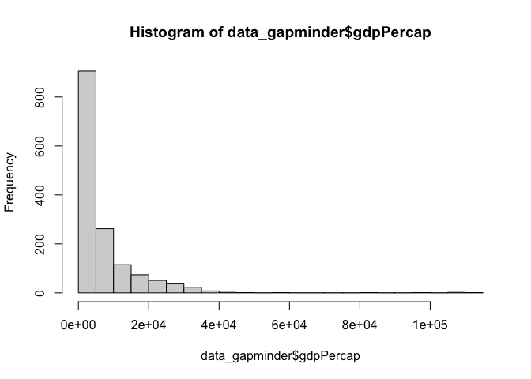
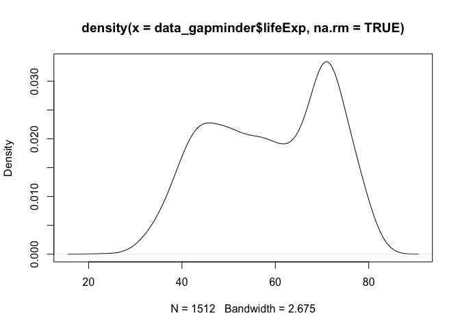
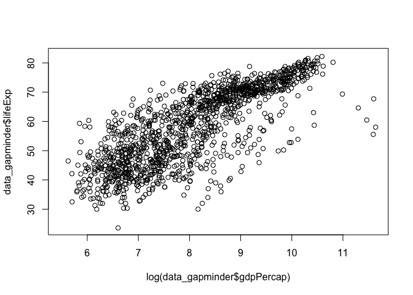

Last Updates: 2024-10-17

## Missing Values

### is.na()

Missing values in R are coded as `NA`, a special value in R. When importing or tyding your data, it's important to ensure that you're properly identifying missing values, and handling them with the arguments `na.strings`, if using `read.csv()`, or `na`, if using `read_csv()`.


```r
na_values <- c("NA", "NULL", "", " ")
data_gapminder <- read.csv("../data/gapminder_nas.csv", na.strings = na_values)
```

With the data loaded, we can investigate missing values. `is.na()` returns a logical vector, `TRUE` for `NA`, otherwise `FALSE`. This is easiest with a single vector...


```r
# get colnames
colnames(data_gapminder)
```

```
## [1] "country"   "continent" "year"      "lifeExp"   "pop"       "gdpPercap"
```

```r
# generate logical vector
missing_pop <- is.na(data_gapminder$pop)
typeof(missing_pop)
```

```
## [1] "logical"
```

```r
head(missing_pop)
```

```
## [1] FALSE FALSE FALSE FALSE FALSE FALSE
```

The logical vector on it's own, is not super helpful. We can generate counts of the `TRUE` values by summing the number of `TRUE` instances in `missing_pop`...


```r
sum(missing_pop)
```

```
## [1] 223
```

We can do this more interactively with


```r
sum(is.na(data_gapminder$pop))
```

```
## [1] 223
```

### Complete Cases

Another point of interest in looking at missing values is to explore the number of observations for which no data are missing, which can be done with `complete.cases()`. Similar to `is.na()`, `complete.cases()` returnds a logical vector...


```r
complete_gapminder <- complete.cases(data_gapminder)
typeof(complete_gapminder)
```

```
## [1] "logical"
```

We can get a count, like before


```r
sum(complete_gapminder)
```

```
## [1] 853
```

And for use later, when subsetting, we can also generate a vector of those which are complete, identified by  their index number. This is done with `which()`


```r
# first few index numbers of comlpete cases
head(which(complete_gapminder))
```

```
## [1]  2  3  4  5  8 12
```

## Unique values & duplicates

`unique()`, returns a vector of unique values...


```r
unique(data_gapminder$continent)
```

```
## [1] "Asia"     "Europe"   "Africa"   "Americas" "Oceania"
```

`duplicated()` returns a logical vector, `TRUE` for values (of a vector) or rows (of a data frame) that are duplicates, `FALSE` if they are unique. Since the first instance of a value is unique, the first value will return `FALSE`, and any subsequent duplicates will return `TRUE`.


```r
# on a vector
head(duplicated(data_gapminder$continent))
```

```
## [1] FALSE  TRUE  TRUE  TRUE  TRUE  TRUE
```

```r
# there are 5 unique continents and 1699 duplicates
sum(duplicated(data_gapminder$continent))
```

```
## [1] 1699
```

```r
# on a data frame
head(duplicated(data_gapminder))
```

```
## [1] FALSE FALSE FALSE FALSE FALSE FALSE
```

```r
# there are no duplicate values
sum(duplicated(data_gapminder))
```

```
## [1] 0
```

## Descriptive Statistics

> Basic stats fucntions in R generally do not remove NA values by default, and if your data has NA values, they will return `NA`. You can avoid these errors with `na.rm = TRUE` as an argument.

### Number of Observations

The number of values in a single vector can be derived with `length()`


```r
length(data_gapminder$country)
```

```
## [1] 1704
```

When used on a data frame, however, `length()` returns the number of columns...


```r
length(data_gapminder)
```

```
## [1] 6
```

When working with data frames, it is preferable to use `nrow()` and `ncol()` for the number of rows and columns, respectively.


```r
ncol(data_gapminder)
```

```
## [1] 6
```

```r
nrow(data_gapminder)
```

```
## [1] 1704
```

### Range

The range of your data can be calculated with `range()`.


```r
range(data_gapminder$year, na.rm = TRUE)
```

```
## [1] 1952 2007
```

If you're only interested in the min or max values individually, this can be pulled with `min()` and `max()` respectively.


```r
min(data_gapminder$year, na.rm = TRUE)
```

```
## [1] 1952
```

```r
max(data_gapminder$year, na.rm = TRUE)
```

```
## [1] 2007
```

### Mean & Median

The mean and median are calculated with `mean()` and `median()` respectively...


```r
mean(data_gapminder$lifeExp, na.rm = TRUE)
```

```
## [1] 58.9021
```

```r
median(data_gapminder$gdpPercap, na.rm = TRUE)
```

```
## [1] 3242.531
```

### Variance and Standard Deviation

The variance and SD are calculated with `var()` and `sd()`...


```r
var(data_gapminder$lifeExp, na.rm = TRUE)
```

```
## [1] 165.1613
```

```r
sd(data_gapminder$lifeExp, na.rm = TRUE)
```

```
## [1] 12.85151
```

### Quantiles

Quantiles can be derived with `quantile()`, which defaults to the max, min and interquartiles.


```r
quantile(data_gapminder$gdpPercap, na.rm = TRUE)
```

```
##          0%         25%         50%         75%        100% 
##    241.1659   1147.3888   3242.5311   8533.0888 113523.1329
```

### Summaries

Much of the above can be gathered all at once if needed with `summary()`. `summary()` can be run on a single vector, or on an entire data frame...


```r
summary(data_gapminder$gdpPercap)
```

```
##     Min.  1st Qu.   Median     Mean  3rd Qu.     Max.     NA's 
##    241.2   1147.4   3242.5   6839.5   8533.1 113523.1      219
```

```r
summary(data_gapminder)
```

```
##    country           continent              year         lifeExp     
##  Length:1704        Length:1704        Min.   :1952   Min.   :23.60  
##  Class :character   Class :character   1st Qu.:1962   1st Qu.:47.83  
##  Mode  :character   Mode  :character   Median :1977   Median :59.63  
##                                        Mean   :1979   Mean   :58.90  
##                                        3rd Qu.:1992   3rd Qu.:70.60  
##                                        Max.   :2007   Max.   :82.60  
##                                        NA's   :217    NA's   :192    
##       pop              gdpPercap       
##  Min.   :6.001e+04   Min.   :   241.2  
##  1st Qu.:2.736e+06   1st Qu.:  1147.4  
##  Median :6.703e+06   Median :  3242.5  
##  Mean   :2.835e+07   Mean   :  6839.5  
##  3rd Qu.:1.836e+07   3rd Qu.:  8533.1  
##  Max.   :1.319e+09   Max.   :113523.1  
##  NA's   :223         NA's   :219
```

A better summary would come from properly denoted data types...


```r
# summary with the first three columns classed as categorical data
summary(data_gapminder)
```

```
##         country        continent        year        lifeExp     
##  Afghanistan:  12   Africa  :624   1962   :132   Min.   :23.60  
##  Albania    :  12   Americas:300   1957   :128   1st Qu.:47.83  
##  Algeria    :  12   Asia    :396   1967   :127   Median :59.63  
##  Angola     :  12   Europe  :360   1952   :125   Mean   :58.90  
##  Argentina  :  12   Oceania : 24   1982   :125   3rd Qu.:70.60  
##  Australia  :  12                  (Other):850   Max.   :82.60  
##  (Other)    :1632                  NA's   :217   NA's   :192    
##       pop              gdpPercap       
##  Min.   :6.001e+04   Min.   :   241.2  
##  1st Qu.:2.736e+06   1st Qu.:  1147.4  
##  Median :6.703e+06   Median :  3242.5  
##  Mean   :2.835e+07   Mean   :  6839.5  
##  3rd Qu.:1.836e+07   3rd Qu.:  8533.1  
##  Max.   :1.319e+09   Max.   :113523.1  
##  NA's   :223         NA's   :219
```

## Visualizing Distributions

> Plotting for presentation will be covered in greater detail in a future session.

Basic plotting for distribution analysis is relatively straight forward in base R.

### Distribution of a Single Variable

#### Histograms

You can plot a basic histogram with `hist()`


```r
hist(data_gapminder$gdpPercap)
```

<!-- -->

And you can increase the 'buckets' with the `breaks` argument


```r
hist(data_gapminder$gdpPercap, breaks = 30)
```

<!-- -->

#### Density Plots

A density plot can be generated with `plot()`, but requires the extra step of computing the density of the data with the `density()` function first


```r
dens <- density(data_gapminder$lifeExp, na.rm = TRUE)
plot(dens)
```

<!-- -->

### Distribution of Two Variables

#### Box Plots

`boxplot()` allows you to facet one variable by another using a tilde `~` to define the relationship


```r
boxplot(data_gapminder$lifeExp ~ data_gapminder$continent)
```

<!-- -->

#### Scatter Plots

`plot()` by default assumes a single variable as in the earlier example, but will generate a scatter plot if provided with two variables, the first assigned to the x-axis, the second to the y-axis.


```r
plot(x = data_gapminder$gdpPercap, y = data_gapminder$lifeExp)
```

<!-- -->

You can also transform you data within the function for quick investigation


```r
# log transform gdp per capita
plot(x = log(data_gapminder$gdpPercap), y = data_gapminder$lifeExp)
```

<!-- -->


## Test your R might

Here are some examples for you to look at and challenge yourself, ensuring you now have a better understanding of today's session!

Q1. You are given the following dataset of students' grades:

```r
df <- data.frame(
  Name = c("John", "Alice", "Bob", "Alice", "Mary", "John"),
  Math = c(85, NA, 79, NA, 93, 85),
  Science = c(78, 88, 84, 88, NA, 78),
  English = c(92, 90, 85, 90, 88, 92)
)
```
Part A. Identify the missing values and compute how many complete cases there are in this dataset.

Part B. How many duplicate rows exist, and how would you remove them?

Part C. Once you’ve removed the duplicates, compute the mean Math score, handling the missing values properly.


Q2. You have a dataset of car attributes, with columns: Horsepower, Weight, and MPG (Miles per Gallon) [To access the dataset, you can use `data(mtcars)`].

Part A. Calculate the summary statistics (mean, median, and standard deviation) for each variable.

Part B. Create a box plot to compare the distribution of `Horsepower` and `MPG`. What insights can you derive from the box plot?

Part C. Create a scatter plot between `Weight` and `MPG`. Explain whether there is any relationship between these two variables and interpret the plot.


