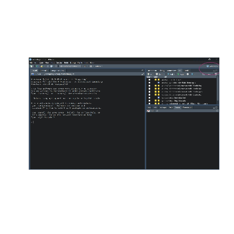
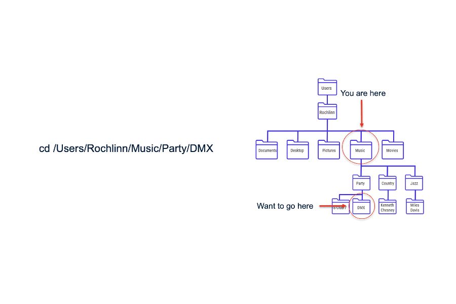

```{r setup, include = FALSE}
knitr::opts_chunk$set(echo = TRUE,
                      eval = FALSE)
```

# Where do your data live before R

- MS Excel, Google Sheets, CSV, Databases, Websites/APIs

:::notes
We usually visualize our data as existing in distinct files that we can interact with. Google sheets, CSV, Excel files &c. These consist of rows, columns, and cells. Well what happens when we import these files into R? What do we have to think about once we get there?
:::

# Importing versus opening data

- When you work with data in R you have move from *opening* data files to *importing* data into data structures.

- When you import data into R you aren't clicking on rows, columns and cells in excel or google sheets anymore you are manipulating *objects*.

:::notes
One of the most confusing aspects of learning your first programming langauge is that data are no longer CSVs, or Excel files. True, that's where the data are still stored in your desktop, but once you *import* data they become *objects* (stored in data structures) that you can manipulate.
:::

# Think-pair-share

- Lets say you have opened a file in R (health_data.csv). You edit a cell in the data structure in R. What happens to the original `health_data.csv` file?

:::notes
The answer is nothing. Once you begin manipulating data in R, you would need to first save that those edits to the file using a call like `write.csv` to the original file (not recommended). Otherwise all you are doing is editing the *object* in R. This leads into how R knows where the file lives. How does R know where the csv tha tyou want ot manipulate lives?
:::


# File structures

- File structures often referred to as **trees**
- Folders are often referred to as **directories**


```{r, eval = TRUE, echo = FALSE}
fs::dir_tree(path = "../assets/demo-file-struct", recurse = 1)
```

:::notes
A common issue I ran into when I used to TA for statistics and computer science classes was the notion of the file structure or directory structure. People who work with computers will often use the terms `file` and `directory` interchangeably. If you understand file structure and directory structure than many common problems that people who are new to coding fall away.
:::

# The Working Directory

- The **working directory** is a *term of art* for the directory where your project lives

```{r, eval = TRUE}
getwd()
```

:::notes
The current working directory can be seen using the `getwd()` command. Similarly we can manually set the working directory by using the `setwd()` command. However this is not recommended as it requires us to set relative versus absolute paths.
:::

```{r}
# This is not recommended
# setwd()
```

# R Projects

- The best way to keep track of files (and the way I do it) is with **R Projects**

```{r generate create R Project GIF, echo = FALSE}
# this chunk generates a gif to be used in this slide

library(animation); library(magick); library(here)

files <- list.files("../docs/assets/images", pattern = "R_projects-", full.names = TRUE)
files <- files[c(2, 1, 3)]
ani.options(interval = 2)
animation::saveGIF({
  for (f in files) {
    img <- image_read(f)
    plot(as.raster(img))           # draw each JPG as a plot frame
  }
}, movie.name = here::here("docs", "assets", "gifs", "R_projects.gif"),ani.width = 900, ani.height = 600)
```

:::notes
So I have included a GIF on how to create a new RStudio Project. When you open the .Rproj file, RStudio automatically sets the working directory to that project folder.
No more setwd() headaches or “file not found” errors. All your scripts, datasets, and figures live inside one consistent structure. Makes sharing and collaboration much easier because it works seamlessly with major version control softwares. Don't worry if you don't know what that is yet, I will be running a whole series on Git and GitHub later on in the semester. Projects also remember your R environment, active tabs, and even console history when you reopen them. You can easily link a project to Git for version control — every project is its own repository. For teaching or research, it ensures every student or collaborator starts from the same structure.
:::

# Relative versus absolute filepaths


```{r generate absolute v relative filepath GIF, echo = FALSE}
# this chunk generates a gif to be used in this slide

library(animation); library(magick); library(here)
# pull the existing relative and absolute path diagrams
files <- list.files("../docs/assets/images", pattern = "-path", full.names = TRUE)
ani.options(interval = 2)        # ~6 fps
animation::saveGIF({
  for (f in files) {
    img <- image_read(f)
    plot(as.raster(img))           # draw each JPG as a plot frame
  }
}, movie.name = here::here("docs", "assets", "gifs", "file-path-example.gif"),ani.width = 900, ani.height = 600)
```



# Working with absolute and relative filepaths

```{r}
# This is not recommended
# file.path("C:/Users/jackx/Desktop/csc/Workshops/docs/assets/")
# This is recommmended and reproducible
# file.path("../docs/assets/gifs/file-path-example.gif")
```

- Note that the `.` operator in a filepath signifies the current *working directory*.
- This operator can be used any number of times to specify higher levels of the file structure.

:::notes
The reason why you *do not* want to work with absolute filepaths is that this will absolutely break if you try to work on this codebase on another computer. For example if another person wants to download your code and use it (say you publish with some code) and the whole project lives in a folder called `Workshops` then the whole file structure before `Workshops` will in all likelihood not exist. Instead we should work with `relative` filepaths whenever possible (and it's almost always possible in my experience). To specify a *relative* filepath we can simply use the `.` operator within our file path string. This operator can be used any number of times to specify higher levels of the file structure. For example, lets say we are working in the `workshops/guides` then to specify the `assets/gifs` directory we would need to say `../assets/gifs`. 
:::

# Base R

:::notes
`read.table()` is R's primary means of importing data, allowing the user to specify a variety of options. `read.csv()` and `read.delim()` are two wrappers on `read.table()` to simplify the import of comma separated and tab delimited files; the only difference between the two is the delimiter that they expect.
:::

# `read.csv()`

```{r}
# import from directory
data_local <- read.csv("../data/gapminder.csv")

# import from url
url <- 'https://raw.githubusercontent.com/jstaf/gapminder/master/gapminder/gapminder.csv'
data_url <- read.csv(url)
```

:::notes
using `read.csv()` is as simple as specifying a directory or url from which to import data...

By default, it assumes your file has a header and that any blank values contain the characters `NA`. Depending on our data source, however, we may need to adjust these parameters...
:::

```{r}
# a set of possible NA values
na_values <- c("NULL", "NA", "N/A", "99", "", " ")
data_custom_na <- read.csv("../data/gapminder.csv", na.strings = na_values)

# a file with no header
data_no_header <- read.csv("../data/gapminder.csv", header = FALSE)
```

It may also be a good idea to trim excess white space, which is not done by default...

```{r}
data_nows <- read.csv("../data/gapminder.csv", strip.white = TRUE)
```

:::note
TRUE and FALSE can be denoted with either `T` and `F` or `TRUE` and `FALSE`. However, `T` and `F` as variable names can be overwritten to point to other objects, whereas `TRUE` and `FALSE` cannot. It is advisable to always use `TRUE` and `FALSE`.
:::

Additional options and their defaults can be found with `?read.table()`.


# Tidyverse


```{r}
library(readr)
data_readr <- read_csv("../data/gapminder.csv")
```

:::notes
`read.csv()` and `read_csv()` are very similar. `read_csv()` is ostensibly faster, it also loads data into a tibble as opposed to a data frame, and has more user friendly defaults. It does, however, require loading additional packages.

As with `read.csv()` and `read.delim`, `read_csv()` and `read_tsv()` -- for tab separated values -- are wrappers on `read_delim()` that is more flexible.

`read_csv()` assumes the file has a header, it trims white space by default, and that missing data are either blank cells or contain the character `NA`. To adjust these, use the arguments `col_names = FALSE`, `na = na_values`, `trim_ws = FALSE`.
:::


# Excel

```{r}
library(readxl)
data_xls <- read_excel("../data/gapminder.xlsx")
data_xls_df <- as.data.frame(read_excel("../data/gapminder.xlsx"))
```

:::notes
Base R does not include a package for loading in Excel files. For this we'll use the tidyverse package `readxl`, which can read both legacy `xls` as well as more recent `xlsx` files.
This is tidyverse, and so `read_excel()` loads a tibble object. If you need or want a data frame, you'll need to adjust for that...
:::

# More In-Depth with Tidyverse `read_excel`

```{r}
data_xls <- read_excel("../data/gapminder.xlsx", sheet = '1952', range = "A1:D5")
```

:::notes
You can specify specific sheets and ranges with the `sheet` and `range` arguments...Additional options and their defaults can be found with `?readxl` or by visiting [https://readxl.tidyverse.org/](https://readxl.tidyverse.org/).
:::