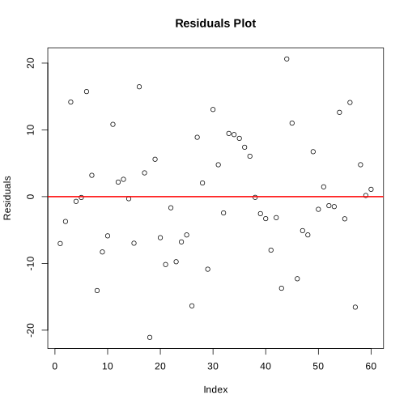
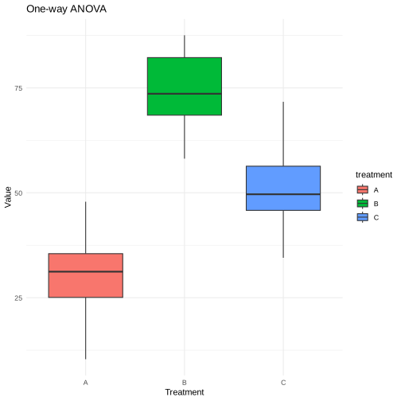
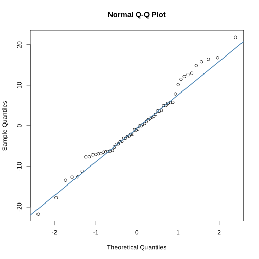

# One-Way ANOVA Analysis in R

This document outlines the steps taken to perform a one-way/two-way ANOVA analysis using R. The goal is to compare the effects of three different treatments on a continuous outcome variable.

```{r}
# Set seed for reproducibility
set.seed(123)

# Simulate data for a one-way ANOVA with three treatments
group_a <- rnorm(20, mean = 30, sd = 10) # Treatment A
group_b <- rnorm(20, mean = 75, sd = 10) # Treatment B
group_c <- rnorm(20, mean = 50, sd = 10) # Treatment C
# Combine the data into a data frame
data_anova <- data.frame(
  value = c(group_a, group_b, group_c),
  treatment = factor(rep(c("A", "B", "C"), each = 20))
)
```
## Perform One-Way ANOVA

- **Objective**: Determine if there are statistically significant differences among the means of three or more independent groups.
```{r}
# Perform one-way ANOVA
anova_result <- aov(value ~ treatment, data = data_anova)
summary(anova_result)
```

```{r}
# QQ plot of residuals from one-way ANOVA
qqnorm(residuals(anova_result))
qqline(residuals(anova_result), col = "steelblue", lwd = 2)

```
    

    
* Objective: Assess the normality of the residuals, an assumption of ANOVA.

```{r}
# Residual plot from one-way ANOVA
plot(residuals(anova_result), main = "Residuals Plot", xlab = "Index", ylab = "Residuals")
abline(h = 0, col = "red", lwd = 2)
```


* Objective: Evaluate the homogeneity of variances and check for any patterns in the residuals.

```{r}
# Perform linear model
lm_result <- lm(value ~ treatment, data = data_anova)
summary(lm_result)
```

* Objective: Provide an alternative method to analyze the data, offering detailed statistics and insights into the relationship between the treatment groups and the outcome variable.

```{r}
# Plotting using ggplot2
library(ggplot2)
ggplot(data_anova, aes(x = treatment, y = value, fill = treatment)) +
  geom_boxplot() +
  theme_minimal() +
  labs(title = "One-way ANOVA", y = "Value", x = "Treatment")

```


    

    


## Perform Two-Way ANOVA

- **Objective**: The objective of a two-way ANOVA is to evaluate the main effects of two independent variables on a dependent variable and to investigate if there's a significant interaction between them that affects the outcome.


```{r}
# Set seed for reproducibility
set.seed(123)

# Simulate data for a one-way ANOVA with three treatments
group_a <- rnorm(20, mean = 30, sd = 10) # Treatment A
group_b <- rnorm(20, mean = 75, sd = 10) # Treatment B
group_c <- rnorm(20, mean = 50, sd = 10) # Treatment C
# Combine the data into a data frame
data_anova <- data.frame(
  value = c(group_a, group_b, group_c),
  treatment = factor(rep(c("A", "B", "C"), each = 20))
)
```

```{r}
set.seed(123)

# Simulate data for a two-way ANOVA with three treatments and two blocks
group_a_day1 <- rnorm(10, mean = 30, sd = 10) # Treatment A, Day 1
group_b_day1 <- rnorm(10, mean = 75, sd = 10) # Treatment B, Day 1
group_c_day1 <- rnorm(10, mean = 50, sd = 10) # Treatment C, Day 1

group_a_day2 <- rnorm(10, mean = 30, sd = 10) # Treatment A, Day 2
group_b_day2 <- rnorm(10, mean = 75, sd = 10) # Treatment B, Day 2
group_c_day2 <- rnorm(10, mean = 50, sd = 10) # Treatment C, Day 2

# Combine the data into a data frame
data_anova_block <- data.frame(
  value = c(group_a_day1, group_b_day1, group_c_day1, group_a_day2, group_b_day2, group_c_day2),
  treatment = factor(rep(c("A", "B", "C", "A", "B", "C"), each = 10)),
  day = factor(rep(c("Day1", "Day1", "Day1", "Day2", "Day2", "Day2"), each = 10))
)
```


```{r}
# Perform two-way ANOVA with interaction between treatment and block
anova_block_result <- aov(value ~ treatment + day + treatment:day, data = data_anova_block)
summary(anova_block_result)

```
```{r}
# QQ plot of residuals from two-way ANOVA
qqnorm(residuals(anova_block_result))
qqline(residuals(anova_block_result), col = "steelblue", lwd = 2)
```
   

    

```{r}
# Residual plot from two-way ANOVA
plot(residuals(anova_block_result), main = "Residuals Plot", xlab = "Index", ylab = "Residuals")
abline(h = 0, col = "red", lwd = 2)

```

```{r}
# Perform linear model with interaction
lm_block_result <- lm(value ~ treatment * day, data = data_anova_block)
summary(lm_block_result)
```
```{r}
# Plotting using ggplot2, showing interaction
ggplot(data_anova_block, aes(x = treatment, y = value, fill = day)) +
  geom_boxplot() +
  theme_minimal() +
  labs(title = "Two-way ANOVA with Blocking", y = "Value", x = "Treatment")

```

```{r}
# Perform one-way ANOVA focusing only on treatment effects
anova_result <- aov(value ~ treatment, data = data_anova_block)
summary(anova_result)


ggplot(data_anova_block, aes(x = treatment, y = value, fill = treatment)) +
  geom_boxplot() +
  theme_minimal() +
  labs(title = "One-way ANOVA", y = "Value", x = "Treatment")
```

```{r}
# Perform one-way ANOVA focusing only on treatment effects
anova_result <- aov(value ~ treatment, data = data_anova_block)
summary(anova_result)


ggplot(data_anova_block, aes(x = treatment, y = value, fill = treatment)) +
  geom_boxplot() +
  theme_minimal() +
  labs(title = "One-way ANOVA", y = "Value", x = "Treatment")
```

# Summary of One-Way vs. Two-Way ANOVA

## One-Way ANOVA

- **Focus**: Examines the effect of a single factor (treatment) on a dependent variable.
- **Objective**: Determine if there are significant differences between the means of three or more groups.
- **Usage**: Ideal when interested in the impact of one independent variable.

## Two-Way ANOVA

- **Focus**: Assesses the impact of two independent variables (treatments and blocks) on a dependent variable.
- **Objective**: Evaluate the main effects of each independent variable and their interaction effect on the dependent variable.
- **Usage**: Suitable for exploring the combined effect of two variables and their interaction.