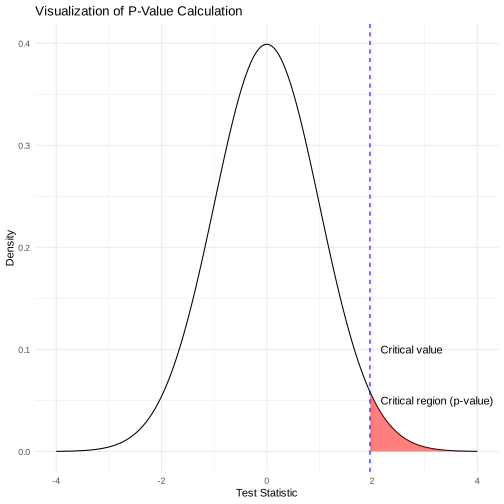
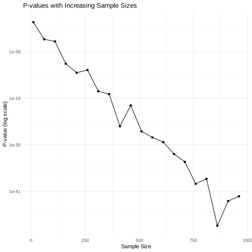
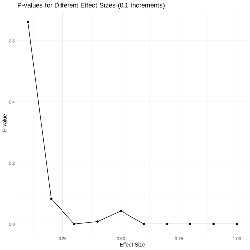

# P value, Significance, and T-test

### Misconception 1: The p-value indicates the probability of the null hypothesis being true.
**Reality:** The p-value actually indicates the probability of observing data as extreme as, or more extreme than, what was observed, assuming the null hypothesis is true. It is not a direct probability of the null hypothesis itself.

### Misconception 2: A smaller p-value means a more important or impactful result.
**Reality:** The p-value does not measure the size of an effect or the importance of a result. It only measures the strength of evidence against the null hypothesis. A small p-value indicates that such a result is unlikely to occur if the null hypothesis were true, but says nothing about the practical significance of the finding.

### Misconception 3: The p-value can tell you the chance of a Type I error (false positive).
**Reality:** The p-value itself is not the probability of a false positive; it is conditioned on the null hypothesis being true. The predefined alpha level (like 0.05) is what sets the Type I error rate, not the p-value.

### Misconception 4: If a test statistic falls within the critical region, the null hypothesis can be rejected with 100% certainty.
**Reality:** Even if the test statistic falls in the critical region and we reject the null hypothesis, there is still a chance of a Type I error. We never prove or disprove hypotheses with absolute certainty in statistics; we only assess evidence against a null hypothesis.

### Misconception 5: A non-significant result (p-value above the threshold) means there is no effect or the study was wrong.
**Reality:** A non-significant result simply means there was not enough evidence to reject the null hypothesis given the data. It could be due to a small effect size, insufficient power, or just random chance.

### Misconception 6: The p-value tells you the magnitude of the effect or its clinical importance.
**Reality:** The p-value does not give any information about how large or important an effect is. Other statistics, like the effect size and confidence intervals, are needed to understand the magnitude of an effect.

### Misconception 7: P-values are not affected by sample size.
**Reality:** P-values are highly sensitive to sample size. With very large samples, even tiny, trivial effects can produce very small p-values, while in small samples, even large effects may not be statistically significant (reflected in the code that plots p-values with increasing sample sizes).

### Misconception 8: P-values provide a measure of the probability that the observed data was produced by chance alone.
**Reality:** The p-value does not measure the probability that the observed data was produced by chance alone. It measures how compatible the data are with the null hypothesis.


```R
library(tidyverse)

```

    ── [1mAttaching packages[22m ─────────────────────────────────────── tidyverse 1.3.2 ──
    [32m✔[39m [34mggplot2[39m 3.4.2     [32m✔[39m [34mpurrr  [39m 1.0.1
    [32m✔[39m [34mtibble [39m 3.2.1     [32m✔[39m [34mdplyr  [39m 1.1.1
    [32m✔[39m [34mtidyr  [39m 1.3.0     [32m✔[39m [34mstringr[39m 1.5.0
    [32m✔[39m [34mreadr  [39m 2.1.3     [32m✔[39m [34mforcats[39m 0.5.2
    ── [1mConflicts[22m ────────────────────────────────────────── tidyverse_conflicts() ──
    [31m✖[39m [34mdplyr[39m::[32mfilter()[39m masks [34mstats[39m::filter()
    [31m✖[39m [34mdplyr[39m::[32mlag()[39m    masks [34mstats[39m::lag()


```R
# Define the mean and standard deviation
mean <- 0
std_dev <- 1

# Define the critical value (e.g., for a Z-score of 1.96 corresponding to a 95% confidence level)
critical_value <- 1.96

# Create a sequence of x values for the normal distribution
x <- seq(-4, 4, length.out = 1000)
# Calculate the density of the normal distribution for each x value
y <- dnorm(x, mean, std_dev)

# Create a dataframe for plotting
data <- data.frame(x, y)

# Plot the normal distribution
p <- ggplot(data, aes(x, y)) +
  geom_line() +
  geom_area(data = subset(data, x > critical_value), fill = "red", alpha = 0.5) +
  geom_vline(xintercept = critical_value, linetype = "dashed", color = "blue") +
  annotate("text", x = critical_value + 0.2, y = 0.1, label = "Critical value", hjust = 0) +
  annotate("text", x = critical_value + 0.2, y = 0.05, label = "Critical region (p-value)", hjust = 0) +
  ggtitle("Visualization of P-Value Calculation") +
  xlab("Test Statistic") +
  ylab("Density") +
  theme_minimal()

# Display the plot
print(p)
```





- **Visualize Normal Distribution**: Plots a curve to show data distribution (mean=0, std dev=1).
- **Critical Region**: Shades area past critical value (1.96) to denote the critical region at a 95% confidence level.
- **P-Value**: Highlights the p-value area, illustrating the probability of results as extreme as observed under the null hypothesis.


```R
 # Simulate 10000 p-values under the null hypothesis
set.seed(123) # For reproducibility
p_values <- replicate(10000, {
  sample_data <- rnorm(30) # 30 samples from a standard normal distribution (mean=0, sd=1)
  test_result <- t.test(sample_data)
  test_result$p.value
})

# Plot the distribution of p-values
hist(p_values, breaks=40, main="Distribution of p-values under the Null Hypothesis", xlab="p-value")
abline(v=0.05, col="red", lwd=2, lty=2)

```


- **Simulate P-Values**: Generates 10,000 p-values from simulated experiments under the null hypothesis using a standard normal distribution (mean=0, sd=1) for 30 samples each.
- **Set Seed**: Ensures reproducibility of results by setting a seed value (123).
- **T-Test**: Applies a t-test to each set of 30 samples to calculate p-values.
- **Plot Distribution**: Creates a histogram to visualize the distribution of the 10,000 p-values.
- **Highlight Significance Threshold**: Marks the 0.05 significance level with a red dashed line, indicating the conventional cutoff for statistical significance.
- This  emphasizes that under the null hypothesis, p-values are uniformly distributed. This uniform distribution is critical for understanding why a p-value of 0.05 is used as a threshold for significance, indicating that if the null hypothesis is true, 5% of studies will erroneously find significant results purely by chance.
- This also highlights the importance of understanding that a significant p-value does not confirm the alternative hypothesis but rather suggests that the observed data is unlikely under the assumption of the null hypothesis.


```R
# Generating data for null and alternative hypothesis distributions
x_values <- seq(-4, 4, length.out = 1000)
null_distribution <- dnorm(x_values, mean = 0, sd = 1)
alt_distribution <- dnorm(x_values, mean = 1, sd = 1)
critical_value <- qnorm(0.95, mean = 0, sd = 1)  # For a right-tailed test
p_value_area_x <- seq(critical_value, 4, length.out = 1000)
p_value_area_y <- dnorm(p_value_area_x, mean = 0, sd = 1)

# Creating a data frame for ggplot
data <- data.frame(x_values, null_distribution, alt_distribution)

# Plotting
ggplot() +
  geom_line(data = data, aes(x = x_values, y = null_distribution, color = "Null Hypothesis Distribution"), size = 1) +
  geom_line(data = data, aes(x = x_values, y = alt_distribution, color = "Alternative Hypothesis Distribution"), size = 1) +
  geom_area(data = data.frame(p_value_area_x, p_value_area_y), aes(x = p_value_area_x, y = p_value_area_y), fill = "skyblue", alpha = 0.5) +
  geom_vline(xintercept = critical_value, linetype = "dashed", color = "grey") +
  annotate("text", x = critical_value, y = 0.02, label = "Critical Value", hjust = 1) +
  annotate("text", x = critical_value + 2, y = 0.02, label = "P-value Area", color = "blue") +
  scale_color_manual(values = c("Null Hypothesis Distribution" = "skyblue", "Alternative Hypothesis Distribution" = "salmon")) +
  labs(title = "Corrected Visualization of P-value",
       x = "Value",
       y = "Probability Density") +
  theme_minimal() +
  theme(legend.title = element_blank())

```

    Warning message:
    “[1m[22mUsing `size` aesthetic for lines was deprecated in ggplot2 3.4.0.
    [36mℹ[39m Please use `linewidth` instead.”


- **Generate Distributions**: Creates normal distributions for null (mean=0, sd=1) and alternative (mean=1, sd=1) hypotheses.
- **Critical Value**: Calculates critical value for a right-tailed test at the 95th percentile of the null distribution.
- **P-value Area**: Highlights the area under the null distribution beyond the critical value, representing the p-value.
- **Visualization**: Uses ggplot for plotting, differentiating distributions with colors and marking critical value and p-value area.
- **Purpose**: Demonstrates differences between hypotheses, critical value determination, and p-value concept visually.


```R
# Simulate p-values with increasing sample sizes
set.seed(123)
sample_sizes <- seq(10, 1000, by = 50)
p_values <- sapply(sample_sizes, function(n) {
  data <- rnorm(n, mean = 0.5) # Simulate data with a small effect
  t_test <- t.test(data)
  return(t_test$p.value)
})

data <- data.frame(sample_sizes, p_values)

# Plot
ggplot(data, aes(x = sample_sizes, y = p_values)) +
  geom_line() +
  geom_point() +
  scale_y_continuous(trans = 'log10') + # Log scale to better display p-values
  ggtitle("P-values with Increasing Sample Sizes") +
  xlab("Sample Size") +
  ylab("P-value (log scale)") +
  theme_minimal()
```





- **Simulate P-Values for Increasing Sample Sizes**: Generates p-values from t-tests on data with a slight effect (mean=0.5), for sample sizes ranging from 10 to 1000, increasing by 50.
- **Set Seed for Reproducibility**: Ensures that the simulation can be exactly replicated by setting a seed value (123).
- **Data Preparation**: Creates a data frame mapping each sample size to its corresponding p-value.
- **Plotting**: Utilizes ggplot to plot sample sizes against p-values, incorporating both line and point markers for visualization.
- **Log Scale for P-Values**: Applies a logarithmic scale to the y-axis to more effectively display the range of p-values.


```R
# Define effect sizes with 0.1 increments and sample size
effect_sizes <- seq(0.1, 1.0, by = 0.1) # Effect sizes from 0.1 to 1.0 in increments of 0.1
sample_size <- 100

# Simulate data and calculate p-values for each effect size
p_values <- sapply(effect_sizes, function(d) {
  control_group <- rnorm(sample_size) # Control group, mean = 0
  treatment_group <- rnorm(sample_size, mean = d) # Treatment group with effect size 'd'
  t_test <- t.test(control_group, treatment_group) # Compare the two groups
  return(t_test$p.value)
})

data <- data.frame(effect_sizes, p_values)

# Plotting the relationship between effect size and P-values
ggplot(data, aes(x = effect_sizes, y = p_values)) +
  geom_point() +
  geom_line() + # Adding a line to connect points for better visualization
  ggtitle("P-values for Different Effect Sizes (0.1 Increments)") +
  xlab("Effect Size") +
  ylab("P-value") +
  theme_minimal()

```





- **Define Effect Sizes and Sample Size**: Sets up effect sizes ranging from 0.1 to 1.0 (in 0.1 increments) and a constant sample size of 100 for each simulation.
- **Simulate Data and Calculate P-Values**: For each effect size, simulates a control group (mean=0) and a treatment group (mean=d, where d is the effect size), then performs a t-test to compare the two and calculates the p-value.
- **Data Frame Creation**: Organizes effect sizes and their corresponding p-values into a data frame for plotting.
- **Plot Relationship**: Uses ggplot to display the relationship between effect size and p-value.


```R
# Define a range of t-values for 0 to 6 and specific sample sizes
sample_sizes <- c(3, 4, 5, 10, 20)
t_values <- seq(0, 6, length.out = 300)

# Calculate p-values for each combination of t-value and sample size
plot_data <- data.frame(
  t_value = rep(t_values, times = length(sample_sizes)),
  p_value = unlist(lapply(sample_sizes, function(n) {
    2 * pt(t_values, df = n - 1, lower.tail = FALSE)
  })),
  sample_size = factor(rep(sample_sizes, each = length(t_values)))
)

# Plot the relationship between p-values and t-statistics
p <- ggplot(plot_data, aes(x = t_value, y = p_value, color = sample_size)) +
  geom_line() +
  labs(title = "P-values of t-statistics for Different Sample Sizes",
       x = "t-statistic",
       y = "P-value",
       color = "Sample Size") +
  theme_minimal()

print(p)
```


- **Define T-Values and Sample Sizes**: Specifies t-statistic values from 0 to 6 and a set of distinct sample sizes (3, 4, 5, 10, 20) for analysis.
- **Calculate P-Values**: For each t-value and sample size combination, computes p-values using the t-distribution, doubling the result to account for a two-tailed test.
- **Organize Data**: Arranges t-values, corresponding p-values, and sample sizes into a data frame, preparing it for plotting. Each sample size is treated as a factor to distinguish it in the plot.
- **Plot Relationship**: Utilizes ggplot2 to graph the relationship between t-statistics and p-values.


```R
# Simulate data with a known small effect size under the alternative hypothesis
set.seed(123)
effect_size <- 0.3
sample_data_null <- rnorm(100) # 100 samples from a standard normal distribution
sample_data_alt <- rnorm(100, mean=effect_size) # 100 samples from a normal distribution with a small effect size

# Conduct a t-test to compare the two groups
test_result <- t.test(sample_data_null, sample_data_alt)
test_result$p.value

# Output the p-value and effect size
cat("p-value:", test_result$p.value, "\nEffect size:", effect_size)

```


0.443758558440655


    p-value: 0.4437586
    Effect size: 0.3


```R
# Simulate data where the null hypothesis is false
set.seed(123)
true_effect <- 0.5
sample_data_control <- rnorm(100) # Control group with no effect
sample_data_treatment <- rnorm(100, mean=true_effect) # Treatment group with a true effect

# Conduct a t-test
test_result <- t.test(sample_data_control, sample_data_treatment)

# Check if p-value is below 0.05 and output result
if(test_result$p.value < 0.05) {
  cat("Significant at p < 0.05. p-value:", test_result$p.value, "\n")
} else {
  cat("Not significant at p < 0.05. p-value:", test_result$p.value, "\n")
}

```

    Significant at p < 0.05. p-value: 0.02420057


## Simple Guides

- **Clarify P-Value Meaning**: Stress that p-values represent the probability of observing the obtained data, or more extreme, under the assumption of the null hypothesis being true. They do not indicate the probability that the null hypothesis is correct or the likelihood of the alternative hypothesis.

- **Understand Limitations of P-Values**: Emphasize that p-values alone cannot measure the magnitude or importance of an effect. They should not be used in isolation to make conclusions about the practical significance of findings. Emphasize the need to consider effect sizes and confidence intervals alongside p-values.

- **Avoid Binary Interpretations**: Discourage the simplistic dichotomy of "significant" vs. "not significant" based on arbitrary p-value thresholds like 0.05. Promote a nuanced interpretation of p-values, recognizing that statistical significance does not equate to scientific or practical importance, and that a higher p-value does not necessarily invalidate the research hypothesis.

**Note:** The slides used in this class can be found below.

<iframe src="https://docs.google.com/presentation/d/e/2PACX-1vQBhyXiN0GyTXbA2-KaWIBizdzp037WFQRemzL33neL1-xY_vCaCVjJbqS93eN4Xg/embed?start=false&loop=false&delayms=3000" frameborder="0" width="640" height="389" allowfullscreen="true" mozallowfullscreen="true" webkitallowfullscreen="true"></iframe>

```R

```
